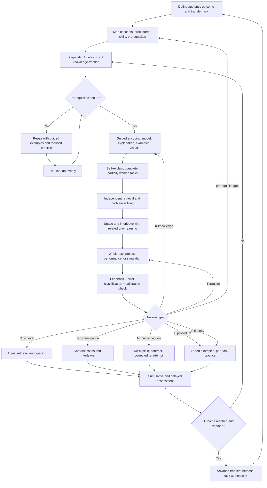
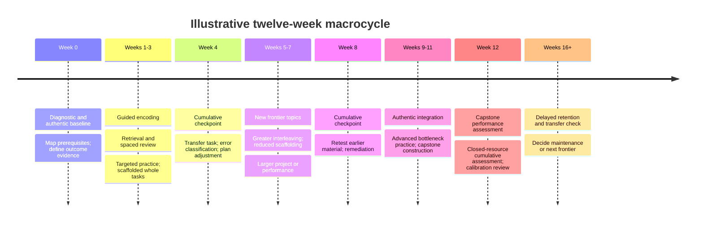

# The Evidence-Adaptive Curriculum Architecture

### A general framework for designing self-directed learning curricula

*Merged and extended synthesis — v2*

---

## Operating card

*The one page to reread. Everything else is elaboration.*

**The premise.** A curriculum is not a study-method catalogue. It is a **closed-loop control system**: define authentic performance → map prerequisites → locate the frontier → encode with controlled load → make durable via retrieval and spacing → build discrimination and fluency → integrate in whole tasks → collect information-rich feedback → classify the failure → route to the matching remedy → remeasure.

**The eight modules.**

| Module | Core question |
|---|---|
| 1. Outcomes and transfer | What must be performed independently, under realistic constraints? |
| 2. Knowledge and skill graph | What prerequisites enable that performance? |
| 3. Guided encoding | How are accurate initial models built without overload? |
| 4. Durable retrieval | How does knowledge stay accessible over months? |
| 5. Discrimination and fluency | How does the right idea get selected, quickly, in novel situations? |
| 6. Whole-task integration | How do components become real competence? |
| 7. Feedback and calibration | How do errors change subsequent learning? |
| 8. Motivation and operations | How does the system survive contact with life? |

**The central discipline: diagnose the failure type before choosing the remedy.**

| Code | Failure | Route to |
|---|---|---|
| `K` | Knowledge absent | Guided encoding; worked examples |
| `R` | Retrieval failure | Spacing/retrieval scheduling |
| `M` | Misconception / wrong model | Re-explain, contrast, corrected re-attempt |
| `D` | Discrimination error | Interleaving of confusable cases |
| `P` | Procedure error | Faded worked examples; part-task practice |
| `F` | Fluency bottleneck | Timed automaticity drills |
| `T` | Transfer failure | Varied whole tasks, new surface conditions |
| `C` | Careless / execution | Process checks, not more content |

More retrieval practice is the correct response to `R` and the wrong response to `T`. That single distinction eliminates most cargo-cult study advice.

**The five knobs, set per domain type.** SRS weight · worked-example weight · block-then-interleave timing · feedback channel · discovery permission. See Part III.

**Non-negotiables.** Retrieval and spacing in every plan. At least one delayed measure per cycle. At least one external feedback channel you do not control. Whole-task performance as the final criterion, never leaf-node mastery.

---

## How to use this document

Parts I–II are the reasoning; skim once, return rarely. **Part III (domain typology) and Part IV (error taxonomy) are the working core** — those are what you consult when instantiating a new subject. Part V holds the templates and the plan-scoring rubric. Part VI has five worked instantiations across deliberately different domain types. Parts VII–IX cover parallel curricula, measurement, and failure modes.

Evidence is tiered explicitly throughout: **[A]** strong and broad, **[B]** moderate or conditional, **[C]** weak, contested, or myth. Where a claim comes from a vendor or practitioner rather than peer review, it is marked **[vendor]**.

---

# Part I — Evidence base

## I.1 The tiering

The goal of tiering is to prevent *learning-technique maximalism* — the habit of stacking every technique with good press without asking what job each one does. Dunlosky and colleagues' 2013 review of ten common techniques found only two in the high-utility band: **practice testing** and **distributed practice**. Interleaving, elaborative interrogation, and self-explanation landed in the moderate band. Summarising, highlighting, rereading, keyword mnemonics, and imagery-for-text landed low. That distribution should shape resource allocation.

### Tier A — strong, broad, build on these

**Retrieval practice / testing effect.** Roediger & Karpicke (2006) is the canonical demonstration: after one week, learners who practised retrieval retained substantially more of a prose passage than those who reread it — while at a five-minute delay the rereaders looked *better* and reported higher confidence. The reversal is the point. Retrieval is a learning event, not a measurement event, and subjective fluency is an unreliable guide. Karpicke & Blunt (2011) extended this to conceptual material, finding retrieval practice outperformed elaborative concept mapping by a large margin even on inference questions.

**Distributed practice / spacing.** Cepeda et al.'s meta-analysis established both the robustness of spacing and its key moderator: the optimal gap scales with the intended retention interval. There is no single universal schedule — only a relationship between how long you want to keep something and how widely you should space it.

**Cognitive load theory family.** Working memory is severely limited for novel, interacting elements. The practical consequences are well-replicated: the **worked-example effect** (Sweller & Cooper 1985 — studying expert solutions beats unguided problem-solving for novices), the **split-attention effect** (integrate text with diagrams rather than separating them), the **redundancy effect**, and the **expertise reversal effect** (Kalyuga et al. 2003 — the same guidance that helps novices *harms* experts). Expertise reversal is the mechanism behind every "fade the scaffolding" prescription in this document; it deserves to be named rather than treated as a design intuition.

**Active learning in structured instruction.** Freeman et al. (2014, PNAS) found active-learning formats outperformed lecture-dominant instruction across undergraduate STEM. Strong within that population; extrapolate to other populations with care.

**Mastery-learning mechanism.** Requiring secure prerequisites before advancing reliably helps. Note the caveat in I.3 about the specific magnitude usually quoted.

**Sleep-dependent consolidation.** Memory consolidation during sleep is well-established, with motor-sequence and procedural learning showing particularly clear overnight gains. This matters more than it usually gets credit for in curriculum design: a session's returns are partly realised the night after. Practically — spacing across sleep is not the same as spacing within a day, and sleep-deprived practice on motor skills is close to wasted effort.

### Tier B — moderate, conditional, or domain-bounded

**Interleaving.** Brunmair & Richter's meta-analysis found a positive overall effect that is heavily moderated by material and task. Interleaving teaches *which* method applies — it is a discrimination intervention, not a general-purpose difficulty knob. It is counterproductive before the individual procedures exist.

**Contextual interference and motor learning.** A distinct literature from the verbal-learning one, and important for any perceptual-motor domain. Shea & Morgan (1979) established the contextual interference effect: random practice orders depress immediate performance but improve retention and transfer relative to blocked orders. **But** Wulf & Shea (2002) is the essential corrective — principles derived from simple laboratory tasks do not automatically generalise to complex motor skills, where high contextual interference early can overwhelm a learner still assembling the coordination pattern. The practical rule for complex motor skills is **block until the pattern is stable, then interleave**, which directly qualifies the general interleaving advice above.

Two further motor-learning findings worth carrying: **variability of practice** (varying parameters within a movement class builds a more general schema than repeating one exact version) and **external focus of attention** (attending to the intended effect rather than to one's own body movements typically improves both performance and learning).

**Expertise as stored pattern recognition.** De Groot's and Chase & Simon's chess work is the foundational demonstration: masters reconstruct *meaningful* board positions dramatically better than novices, but show ordinary recall for randomly arranged pieces. Expertise is not superior raw memory — it is a large stored library of recognised configurations. This generalises well beyond chess to radiology, debugging, code review, and any domain where experts "just see" the answer. Its curricular implication is specific: in such domains, high-volume exposure to *curated, meaningful* patterns with rapid feedback is the highest-leverage activity, and abstract principle-learning is a poor substitute.

**Self-explanation and elaboration.** Chi et al. (1989) showed that learners who spontaneously explain worked examples to themselves learn far more from them. The effect depends on explanations being accurate and structurally relevant — generating more words is not the mechanism.

**Feedback.** Wisniewski, Zierer & Hattie (2020) found a positive average effect with very large heterogeneity. Information content is the moderator: feedback that identifies the discrepancy and what to change outperforms feedback that conveys only correctness or praise. "Feedback" is not one intervention.

**Metacognition and self-assessment.** Panadero, Jönsson & Botella's meta-analysis supports structured self-assessment for self-regulation and self-efficacy. The value comes from *calibration against external performance*, not introspection — predicting a score and comparing it to the result, not reflecting on how the session felt.

**Implementation intentions.** Gollwitzer & Sheeran's meta-analysis (94 independent tests) found a medium-to-large effect of if–then planning on goal attainment. The cheapest reliability intervention available.

**Deliberate practice.** Real but not a complete theory of expertise. Macnamara, Hambrick & Oswald (2014) found deliberate practice explained roughly 26% of performance variance in games, 21% in music, 18% in sports, 4% in education, and under 1% in professions. Ericsson & Harwell (2019) counter that most included studies did not measure genuinely individualised, coach-guided practice. Both are right about something: structured, feedback-rich, edge-of-ability practice is high-value; the strong form of the claim that practice quantity explains expertise is not supported.

**Second-language spacing and interaction.** Kim & Webb's meta-analysis (98 effect sizes, 48 experiments, 3,411 participants) supports spacing in L2 learning, with the evidence base far richer for vocabulary than for other skills. Lyster & Saito's classroom meta-analysis (15 studies, 827 learners) supports durable benefits from oral corrective feedback.

### Tier C — weak, contested, or myth

**Learning styles.** Pashler et al. (2008) found the crossover-interaction evidence required to support the meshing hypothesis essentially absent. Do not design around it. Note the distinction: *dual verbal–visual representation* is well-supported and is a claim about materials, not about learner types.

**Rereading, highlighting, summarising as primary strategies.** Low utility in Dunlosky's review. They persist because they generate fluency, which feels like learning.

**Far transfer as a design goal.** Cognitive-training meta-analyses consistently find near transfer and little to no far transfer. Chess does not make you better at mathematics; abstract "learning to learn" drills do not transfer without domain grounding. Practise the thing you want, in or near its real context.

**Betty Edwards' neurological rationale.** The right-brain framing is not supported. Her *exercises* — contour drawing, negative space, inverted-image copying — remain useful; they work by disrupting symbolic shortcuts, not by switching hemispheres.

## I.2 Assigning each technique a job

| Technique | Its job | When it is the wrong tool |
|---|---|---|
| Spaced retrieval | Keeping accessible knowledge accessible | When the failure is transfer or discrimination |
| Worked examples | Cheap schema acquisition for novices | Once expertise is established (expertise reversal) |
| Interleaving | Learning *which* method applies | Before individual methods exist; early complex motor skills |
| Self-explanation | Linking examples to underlying principles | When the explanation is fluent but wrong and unchecked |
| Deliberate part-task practice | Removing an identified bottleneck | As a substitute for whole-task performance |
| Whole tasks / projects | Integration, transfer, motivation, diagnosis | As a novice's *starting* point in a structured domain |
| Feedback | Changing the next attempt | When it conveys only a score |
| Fluency drilling | Freeing working memory for higher-level work | When accuracy is not yet established |

## I.3 Claims to hold loosely

**Bloom's 2-sigma.** The claim that tutored students outperform 98% of conventionally taught students rests on two unreplicated 1980s dissertations, and Bloom's famous figure was illustrative rather than fitted to data. It is treated today as an outlier. Mastery learning reliably delivers on the order of one sigma; realistic replicable interventions land considerably lower. **Adopt the mechanism — do not advance past insecure prerequisites — and discard the number.**

**Math Academy's FIRe.** [vendor] Their Fractional Implicit Repetition mechanism propagates partial repetition credit from advanced tasks down a knowledge graph to encompassed component skills, rather than scheduling every topic as an independent flashcard. This is a genuinely interesting extension of spacing to hierarchical knowledge, and the *general* insight — that practice can be embedded in higher-level activity rather than always isolated — is sound and portable. The specific credit-assignment weights are a proprietary modelling decision, described in self-published material, not an established result from the spacing literature.

**iCanStudy / Justin Sung.** [vendor] The contribution worth taking is the framing of learning as a trainable operating system: build representations rather than copy information, regulate cognitive load deliberately, decide what needs memorising versus what can be reconstructed, monitor your own learning behaviour, and seek feedback on the *learning process* and not only on the content. That aligns well with independent work on cognitive load, self-explanation, metacognition, and self-regulated learning.

Two caveats, both usefully sourced from their own material. First, iCanStudy states that the exact sequences it uses to develop higher-efficiency encoding have no documented record in the research literature — an unusually candid disclosure that should be preserved rather than obscured. Second, its own domain guidance rates mathematics as high fit, coding as moderate-to-high, and **languages as low**, because pronunciation, listening, and spoken fluency require immersion and interaction the method does not supply. That admission is itself a strong argument for the configurable, domain-typed approach taken in Part III.

Where Sung's public framing positions retrieval and spacing as merely "lower-order" and inefficient relative to superior encoding, the independent evidence does not support the trade-off framing. Karpicke & Blunt found retrieval outperforming elaborative encoding on precisely the deep-comprehension measures where encoding should have won. The correct synthesis is that encoding quality and retrieval are complementary — better encoding reduces how much retrieval you need, but does not remove the need.

**A note on convergence.** This document merges two independently-researched syntheses that agreed closely on the core. That agreement is weak evidence the core is real rather than an artifact of one search path — but both were assembled by the same kind of process from overlapping literatures, so it is not independent replication. Treat the tiering as a reasonable reading of the evidence, not as settled fact.

---

# Part II — The architecture

## II.1 Modules, not stages

The eight modules are **loops, not a linear pipeline**. A project reveals a prerequisite gap. A cumulative test reveals a retrieval problem. A learner who knows every definition but cannot choose among them needs discrimination practice, not more definitions. The architecture's value is that it makes the *routing* explicit.

## II.2 Module 1 — Outcomes and transfer

Write the target as **observable performance under realistic constraints**, never as a topic list. Backward design and constructive alignment both start from desired results and acceptable evidence before selecting activities.

| Weak | Strong |
|---|---|
| "Understand neural networks" | "Given an unfamiliar supervised problem, select a model, train and evaluate without leakage, explain its principal errors, and justify the metric" |
| "Learn Japanese grammar" | "Hold a 10-minute everyday conversation, understand appropriately levelled audio and text, and write a short comprehensible account" |
| "Get better at drawing" | "Draw a convincing figure in a chosen pose from imagination, with readable construction and value structure" |
| "Improve at chess" | "Reach a stable 1600 rapid rating, and correctly evaluate a tactical position within 60 seconds" |

For each outcome, specify five evidence classes:

| Evidence | Question |
|---|---|
| **Recall** | Can it be retrieved without prompts? |
| **Discrimination** | Can the learner tell *when* it applies? |
| **Performance** | Can it be executed accurately, and fluently where that matters? |
| **Transfer** | Does it survive changed surface features and constraints? |
| **Retention** | Does any of the above hold after a meaningful delay? |

The fifth is the one most curricula omit, and the one that distinguishes learning from cramming.

## II.3 Module 2 — The knowledge and skill graph

Decompose the target into five knowledge types, because they demand different treatment:

- **Conceptual** — principles, causal relationships, models
- **Declarative** — terminology, symbols, vocabulary, facts
- **Procedural** — sequences, algorithms, production rules
- **Perceptual / discriminative** — recognising which situation is present
- **Whole-task** — integrating components under realistic conditions

Then build the dependency graph. Mark two things on it: which nodes are **prerequisites requiring fluency** (not mere familiarity — a slow-but-correct foundational operation still bottlenecks complex performance), and which are **leaf nodes safe to leave at recognition level**.

Graph density varies enormously by domain — this is one of the knobs in Part III. Mathematics and quantum computing have unusually explicit, deep dependency chains. Drawing has a much flatter and more entangled structure, where "prerequisite" often means "you can't attend to this until that is automatic" rather than "this is logically required."

## II.4 Module 3 — Guided encoding

The aim is accurate initial models with controlled load. In practice:

- **Prime before consuming.** Skim structure, generate questions, activate prior knowledge. Cheap, and it gives incoming material somewhere to attach.
- **Use worked examples heavily while knowledge is fragile**, then fade: full example → completion problem → similar independent problem → varied independent problem.
- **Self-explain against the principle**, not the surface: "Why does this step follow? What condition makes it valid? How does this differ from the case above?"
- **Integrate verbal and visual**, and keep them physically adjacent — split attention is a real cost, decorative imagery is a real cost.
- **Use non-linear representations when relationships are the content.** Concept maps and similar structures earn their place where the learning objective genuinely is a structure of relations; they are overhead where it is not.

The failure mode here is copying. Transcription feels productive and produces almost nothing.

## II.5 Module 4 — Durable retrieval

**Every curriculum needs a retrieval layer independent of its content source.** Books, videos, and tutorials deliver exposure. They are not a memory system, and treating a completed tutorial as evidence of competence is the most common self-study error.

| Domain type | What retrieval looks like |
|---|---|
| Factual | Free recall, labelling from memory, cued production |
| Conceptual | Explain the mechanism, draw the model, answer "why" |
| Mathematical | Solve without notes, derive, select among methods |
| Programming | Write the function from memory, predict code behaviour |
| Language | Produce the utterance from a communicative cue, dictation |
| Perceptual-motor | Reproduce the technique unaided, from the target effect |
| Diagnostic | Evaluate a case, decide, justify |

**The retrieval task must resemble the future use.** Recognition-format flashcards are inadequate preparation for production-heavy goals. If the goal is speaking Japanese, retrieval means producing Japanese utterances aloud from situational cues. If the goal is debugging models, retrieval means diagnosing broken code, not reciting definitions.

A practical starting schedule tests a new item after roughly one to three days, about a week, a few weeks, then monthly or beyond — moving outward on success and inward on failure. This is an operational default, not an empirical optimum; the right shape depends on the retention horizon.

**Embed retrieval in higher-level work once foundations are reliable.** This is the portable insight behind FIRe. A learner implementing logistic regression is simultaneously refreshing gradients, vector operations, and evaluation metrics. A Japanese learner reading a graded story is refreshing vocabulary, kana decoding, particles, and sentence patterns. Isolated review should be reserved for components that higher-level work does *not* reliably exercise, or where automaticity is still inadequate.

## II.6 Module 5 — Discrimination and fluency

Two distinct jobs, often conflated.

**Discrimination** — knowing which idea applies — is what interleaving buys. The progression is `AAA → AAB → ABC → mixed ABC under novel surface conditions`. Mix *meaningfully confusable* families rather than shuffling indiscriminately, and start only once the individual procedures exist. For complex motor skills, delay the transition further (see Wulf & Shea, I.1).

**Fluency** matters only where automaticity frees attention for higher-level work — but where it matters, it matters a lot. Notation, arithmetic, kana, coding idioms, standard tactical motifs, common chord shapes. Track speed and ease separately from accuracy, since a correct-but-laborious component will silently cap complex performance.

## II.7 Module 6 — Whole-task integration

Every cycle needs substantial work on a task resembling the real thing. The 4C/ID model is the useful reference here precisely because it refuses the projects-versus-instruction dichotomy: whole learning tasks, plus supportive information, plus just-in-time procedural information, plus part-task practice for components needing automaticity.

Graduate the projects:

| Stage | Structure |
|---|---|
| Beginner | Tightly specified inputs, examples, rubric, checkpoints, known techniques |
| Developing | Partial choice of problem or medium; several plausible approaches |
| Intermediate | Authentic ambiguity; learner selects approach; mandatory error analysis |
| Advanced | Open problem definition; external audience or benchmark |
| Expert | Novel contribution, replication, optimisation, teaching, production deployment |

**A project earns its place by creating diagnostic friction.** Record what failed, classify why, repair the underlying gap, re-attempt. A portfolio of polished outputs with no visible revision loop is evidence of nothing.

## II.8 Module 7 — Feedback and calibration

Good feedback answers four questions: where am I going, where am I now, what caused the gap, and what changes on the next attempt. Correctness alone answers one of four.

**Self-study's structural weakness is feedback integrity** — the learner controls both the answer and its evaluation. Every serious plan needs at least one channel the learner does not control: executable tests, engine evaluation, benchmark answers, a tutor or language partner, public artifacts, community critique, objective performance metrics.

**Calibration is measurable and cheap.** Predict the score before seeing the result; log the gap. Calibration error is one of the highest-signal metrics available and almost nobody collects it.

## II.9 Module 8 — Motivation and operations

Design for **autonomy, competence, and meaningful progress** rather than points. Self-determination theory provides the frame; a meta-analysis of experimentally provided choice found improvements across intrinsic motivation, effort, and perceived competence.

Specify habits as implementation intentions, with a fallback:

> **Cue:** After breakfast on scheduled days
> **Action:** Open the task queue and complete the first retrieval set before consuming any new material
> **Fallback:** If a full session is impossible, complete one minimum retrieval action rather than skip the day

Use rewards cautiously — expected tangible rewards can undermine subsequent intrinsic motivation for activities that would otherwise be self-sustaining. Progress indicators should communicate **competence** (topics made durable, benchmarks passed, recurring errors eliminated) rather than volume (hours, streaks, cards).

---

# Part III — Domain typology and knob settings

This is the part that makes the framework usable across genuinely different subjects. The eight modules are constant; **their weights are not.** A framework that prescribes mind maps, flashcards, and projects equally for mathematics and for drawing is not a framework — it is a preference.

## III.1 The knobs

| Knob | Range |
|---|---|
| **Graph density** | Deep explicit prerequisite chains ←→ flat, entangled, "attention-limited" ordering |
| **Explicit SRS weight** | Load-bearing ←→ negligible |
| **Worked-example weight** | Dominant early ←→ marginal (demonstration substitutes) |
| **Block→interleave point** | Interleave early ←→ block long, interleave late |
| **Primary feedback channel** | Automated ground truth ←→ human/perceptual critique |
| **Discovery permission** | Harmful early ←→ essential throughout |
| **Whole-task cadence** | Late, after foundations ←→ from day one |
| **Fluency emphasis** | Critical ←→ irrelevant |

## III.2 The five types

### Type 1 — Hierarchical-cumulative symbolic
*Machine learning theory, quantum computing, mathematics, formal CS*

Deep explicit prerequisite chains; working-memory overload is the binding constraint. Worked examples dominate early and must be faded deliberately. Discovery learning is actively harmful for novices here — the search cost consumes the capacity that schema-building requires. SRS is secondary: notation and definitions benefit, but most retention comes from embedded practice in problem-solving. Fluency matters for notation and routine manipulation.

**Settings:** graph *deep* · SRS *low* · worked examples *high, then fade* · block short, interleave once procedures exist · feedback *automated/verifiable* · discovery *off early* · whole tasks *after foundations* · fluency *moderate-high*

### Type 2 — Perceptual-motor and aesthetic
*Drawing, instruments, physical craft, hardware assembly*

Flat and entangled dependency structure; the knowledge is largely procedural and perceptual and cannot be verbalised into cards. Worked examples become *demonstrations* — watching the process, not studying a finished artifact. Block until the coordination pattern stabilises, then introduce variability. Feedback must be perceptual: overlays, comparison against reference, recording and reviewing, external critique. SRS is close to a trap if made central; it has a small legitimate role for declarative substrate (anatomy landmarks, perspective rules, colour theory). Sleep matters disproportionately.

**Settings:** graph *flat* · SRS *very low* · demonstration *high* · block *long*, then vary · feedback *perceptual/human* · discovery *encouraged once fundamentals exist* · whole tasks *from early* · fluency *high (line confidence, mark-making)*

### Type 3 — Pattern-recognition and search
*Chess, go, medical diagnosis, code review, debugging*

Expertise is a large stored library of recognised configurations (Chase & Simon). The highest-leverage activity is high-volume exposure to *curated, meaningful* patterns with immediate feedback, repeated to automaticity — which is exactly what the Woodpecker method operationalises for chess. Abstract principle-learning underperforms here. Calculation and search discipline are separate trainable subskills. Analysing one's own performances is the key feedback loop, since it surfaces the patterns you personally lack.

**Settings:** graph *moderate* · SRS *moderate, for motifs and openings* · worked examples *moderate (annotated master games)* · interleave *by motif once recognised* · feedback *engine or expert ground truth* · discovery *via own-game analysis* · whole tasks *continuous (real games)* · fluency *critical*

### Type 4 — Large-corpus plus production
*Japanese and other L2, professional vocabularies*

The only type where **SRS is genuinely load-bearing** — there is an irreducible large corpus of arbitrary form-meaning pairs and no way around memorising it. But SRS is a *vocabulary and phrase memory component*, never an acquisition engine. It must sit inside a system with comprehensible input at volume and recurrent communicative output, because pronunciation, listening, and fluency require exposure and interaction that scheduling cannot supply. This is why iCanStudy rates languages low-fit for a study-technique-centred method — and the rating is correct as far as it goes.

**Settings:** graph *moderate (grammar has structure, vocabulary does not)* · SRS *high* · worked examples *low* · interleave *confusable forms early and often* · feedback *human corrective + comprehension checks* · discovery *immersion is essential* · whole tasks *from early (communicative performance)* · fluency *high*

### Type 5 — Integrative engineering
*Robotics, full-stack systems, experimental science*

Combines all four other types in one subject: symbolic theory, motor and hardware intuition, debugging pattern-recognition, and tool-specific vocabulary. The correct model is 4C/ID — whole-task projects as the organising spine, with part-task practice pulled in for whatever the project revealed as a bottleneck. Do not try to complete the theory before building. Do not try to build without any theory. The project *generates the curriculum*.

**Settings:** graph *layered, per subsystem* · SRS *low, tooling only* · worked examples *moderate, just-in-time* · interleave *naturally via integration* · feedback *simulation, tests, physical reality* · discovery *high* · whole tasks *primary organising unit* · fluency *tool-specific*

## III.3 Summary table

| | Type 1 Symbolic | Type 2 Motor/aesthetic | Type 3 Pattern | Type 4 Corpus/production | Type 5 Integrative |
|---|---|---|---|---|---|
| Graph density | Deep | Flat | Moderate | Moderate | Layered |
| SRS weight | Low | Very low | Moderate | **High** | Low |
| Worked examples | **High→fade** | Demonstration | Annotated cases | Low | Just-in-time |
| Block→interleave | Short block | **Long block** | By motif | Early interleave | Emergent |
| Feedback channel | Automated | Perceptual/human | Engine/expert | Human corrective | Reality/tests |
| Discovery early | **Harmful** | Guided | Via analysis | **Essential** | High |
| Whole-task timing | After foundations | Early | Continuous | Early | **Primary** |
| Fluency emphasis | Moderate-high | High | **Critical** | High | Tool-specific |

## III.4 Classifying a new domain

Ask four questions:

1. **Can competence be verbalised?** If mostly no → Type 2.
2. **Is there an irreducible arbitrary corpus?** If yes → Type 4 component.
3. **Do experts recognise rather than derive?** If yes → Type 3 component.
4. **Does the dependency structure have deep chains where skipping is fatal?** If yes → Type 1 component.

Most real subjects are **mixtures**, and the right move is usually to decompose. Robotics is Type 1 (control theory) + Type 2 (hardware intuition) + Type 3 (debugging) + Type 5 (integration), and each component should get its own knob settings rather than one averaged compromise. Quantum computing is Type 1 dominant with a Type 4 component (notation and gate vocabulary). Drawing is Type 2 dominant with a small Type 4 component (anatomy, perspective rules).

---

# Part IV — Diagnosis: the error taxonomy

The single most useful discipline in this framework. Techniques are not good or bad in the abstract; they are **matched or mismatched to a failure type**. Most wasted study time is a well-supported technique applied to the wrong failure.

## IV.1 The codes

| Code | Failure | Signature | Correct remedy | Wrong remedy |
|---|---|---|---|---|
| `K` | Knowledge absent | Never encountered it | Guided encoding, worked example | Retrieval scheduling |
| `R` | Retrieval failure | Recognises on seeing the answer; "I knew that" | Retrieval practice, tighter spacing | More explanation |
| `M` | Misconception | Confident and wrong; consistent error | Contrast cases, re-explain, corrected re-attempt | Repetition (entrenches it) |
| `D` | Discrimination | Knows both A and B; picks the wrong one | Interleaved confusable practice | More isolated study of A |
| `P` | Procedure | Right approach, broken execution | Faded worked examples, part-task drill | Conceptual re-teaching |
| `F` | Fluency | Correct but slow; downstream work suffers | Timed automaticity drilling | More new material |
| `T` | Transfer | Works on practice items, fails in the wild | Varied whole tasks, novel surface features | More flashcards |
| `C` | Careless | Knows it, executed sloppily | Process checks, pacing, fatigue management | Any content intervention |

## IV.2 Why this is the spine

Two learners fail the same item. One never learned it (`K`), one learned and forgot it (`R`), one learned it wrongly (`M`), one confused it with its neighbour (`D`). **Four different next actions.** Without classification, all four get "review it again," which is right for one of them.

The taxonomy also disciplines the diagnosis of *aggregate* patterns:

| Observed pattern | Likely diagnosis | Revision |
|---|---|---|
| High immediate score, low delayed score | Massed, recognition-heavy learning | Increase retrieval and spacing |
| Good recall, poor on unseen problems | `D`/`T` cluster | Add interleaving and varied whole tasks |
| Good exercises, weak projects | Over-scaffolded components | Fade support; increase authenticity |
| Project fails on basics | Prerequisite hole | Return to graph, remediate at frontier |
| Same error recurs after feedback | Feedback isn't changing the representation | Diagnose the misconception; require corrected re-attempt |
| Accurate but slow | `F` | Focused fluency work |
| Cannot predict own performance | Calibration failure | Predict → assess → reflect loop |
| Huge SRS backlog | Over-atomisation | Suspend low-value items; shift to embedded retrieval |
| Adherence falling while performance is fine | Operations failure | Reduce friction, restore autonomy, cut load |
| Many hours, little outcome gain | Technique/failure-type mismatch | Rebuild around authentic performance |

## IV.3 Practical use

Log a code on every meaningful error — an eight-way enum is small enough to be sustainable and large enough to be actionable. Review the *distribution* weekly, not individual errors. A curriculum whose errors are 60% `R` needs a scheduling fix; one whose errors are 60% `T` needs a completely different intervention, and adding review would make it worse.

---

# Part V — Templates

## V.1 Curriculum design template

Copy per domain. Note the ordering: performance and evidence come **before** resources. Activities are selected because they produce the evidence the outcome requires, not because a textbook has twelve chapters.

| Field | Question | Example entry |
|---|---|---|
| **North-star performance** | What authentic task must be performed independently? | "Diagnose and solve unfamiliar X problems and justify the approach" |
| **Domain type** | Which of the five types, or which mixture? | "Type 1 dominant, Type 4 component for notation" |
| **Knob settings** | SRS / examples / block-point / feedback / discovery | Per Part III |
| **Retention horizon** | How long must this stay available? | "Core concepts: years. Tooling details: current project" |
| **Knowledge graph** | Concepts, facts, procedures, distinctions, prerequisites | A → B/C → D → whole task |
| **Fluency nodes** | Which prerequisites need automaticity, not familiarity? | Notation, kana, tactical motifs |
| **Entry diagnostic** | What determines the starting frontier? | Mixed prerequisite test + authentic mini-task |
| **Mastery evidence** | What counts as competent? | Accuracy + justification + novel variant + delayed retest |
| **Encoding resources** | What builds accurate initial models? | Canonical text, worked examples, demonstrations |
| **Retrieval design** | What must be produced from memory, in what format? | Derivations, spoken prompts, from-memory implementations |
| **Spacing rule** | How does prior learning reappear? | Adaptive queue + cumulative whole tasks |
| **Interleaving set** | Which families are confusable? | A/B/C |
| **Deliberate-practice targets** | Which bottlenecks are worth isolating? | Named subskills |
| **Whole task** | What realistic output integrates everything? | Project, conversation, game, drawing, build |
| **Feedback channel** | What diagnoses errors that you don't control? | Tests, engine, tutor, critique, benchmark |
| **Assessment stack** | How are recall, transfer, retention each measured? | Weekly retrieval + monthly performance + delayed test |
| **Calibration** | How is confidence checked? | Predict score; log gap; classify error |
| **Habit spec** | Cue, action, fallback | If–then, with a minimum viable session |
| **Exit criterion** | What permits advancing? | Repeated independent evidence including one delayed and one transfer measure |

## V.2 Plan-quality rubric

Score each 0 (absent) / 1 (partial) / 2 (solid). **Below 16/24, the plan has a structural hole — find it before starting.**

| # | Criterion | 2 points requires |
|---|---|---|
| 1 | Outcome specificity | Observable performance under realistic constraints, not a topic list |
| 2 | Domain-type fit | Type identified; knobs set deliberately, not by default |
| 3 | Prerequisite mapping | Explicit graph; fluency nodes marked |
| 4 | Diagnostic placement | Frontier located empirically, not assumed |
| 5 | Encoding quality | Worked examples or demonstrations with a defined fading path |
| 6 | Retrieval layer | Independent of content source; format matches future use |
| 7 | Spacing | Crosses week boundaries; adaptive to success and failure |
| 8 | Discrimination | Confusable families identified; interleaving point chosen |
| 9 | Whole-task integration | Real performances scheduled, graduating in autonomy |
| 10 | Feedback integrity | At least one channel the learner does not control |
| 11 | Measurement | Includes at least one delayed and one transfer measure |
| 12 | Sustainability | Realistic dose; habit spec with fallback; parallel load accounted for |

Two failure signatures worth naming: a plan scoring high on 3–8 and low on 9–11 is **over-atomised** — it will produce someone who knows everything and can do nothing. A plan scoring high on 9 and low on 3–7 is **premature authenticity** — it will produce frustration, copying, and durable misconceptions.

## V.3 Time allocation

No research establishes universal proportions. This is a planning heuristic that reallocates according to the error distribution.

| Activity | Default share | Increase when |
|---|---:|---|
| Spaced retrieval / cumulative warm-up | 10–20% | `R` errors dominate |
| Guided encoding / new learning | 20–30% | `K` or `M` errors dominate |
| Targeted problems / deliberate subskill practice | 20–30% | `P` or `F` errors dominate |
| Whole-task application | 25–40% | `T` errors dominate; competence is growing |
| Feedback, error analysis, planning | 5–10% | Never below 5%; raise after assessments |

Shift with expertise: a novice spends more on guided examples and targeted practice; an advanced learner spends most of the cycle on authentic tasks, with instruction pulled in on demand when a project fails.

**Adjust by domain type.** Type 2 pushes whole-task share far higher from the start. Type 4 raises the retrieval share substantially. Type 1 keeps guided encoding high for longer than feels comfortable.

## V.4 Session, week, cycle

**Session (45–90 min):**
1. Retrieval warm-up on older material (5–15 min) — *before* new input, always
2. Guided encoding of new material, or continued whole task
3. Practice at the edge of ability
4. Log: what failed, error code, one line on the next action

**Week** — separate the pedagogical functions rather than making every day identical:

| Point in week | Function |
|---|---|
| Early | New models, worked examples, first independent attempts |
| Throughout | Short cumulative retrieval of older material |
| Mid–late | Mixed and interleaved practice; deliberate remediation |
| Late | Whole task — project, performance, conversation, game |
| End | Cumulative mini-assessment, error-log review, calibration check, next-week adjustment |

Spacing must cross week boundaries. A topic learned Monday should not vanish after Friday's check.

**Cycle** — four-week microcycles inside roughly twelve-week macrocycles. The calendar numbers are organisational convenience; the evidence-based features are cumulative retrieval, meaningful spacing, delayed assessment, and adaptation.

## V.5 Assessment stack

| Assessment | Frequency | Diagnoses | Format |
|---|---|---|---|
| Entry diagnostic | Start of block | Prerequisite frontier | Adaptive mixed test + mini performance |
| Retrieval check | Most sessions | Accessibility, forgetting | Low-stakes recall, solve, produce |
| Formative performance | Several per week | Misconceptions, procedures | Problems, code, speech, drawings, games |
| Cumulative checkpoint | Every 3–5 weeks | Cross-topic retention, discrimination | Closed-resource mixed assessment |
| Authentic transfer task | Each major block | Integration and transfer | Project, conversation, real performance |
| Explanation / defence | Milestones | Depth and ownership | Justify choices; answer unseen questions |
| Delayed assessment | Weeks–months later | Durable learning | Alternate-form test or performance |
| Calibration check | With major assessments | Metacognitive accuracy | Predicted vs actual |

**Mastery is not "80% once."** The criterion is: **accurate performance + justification + an unfamiliar variant + evidence after a delay**, with fluency added where the skill requires it. Keep some assessments genuinely diagnostic by using fresh items and withholding feedback until an answer is committed.

## V.6 Scaling with expertise

| Dimension | Beginner | Intermediate | Advanced |
|---|---|---|---|
| Prerequisite mapping | Explicit, fine-grained | Focus on gaps | Learner maps own gaps |
| Instruction | Concise explicit explanation | References + targeted instruction | Primary sources, expert consultation |
| Worked examples | High | Faded, partial | Only for unfamiliar techniques |
| Retrieval | Core facts and procedures | Mixed conceptual and applied | Synthesis, rapid diagnosis |
| Interleaving | After minimal competence | Heavy among confusable families | Broad, authentic variation |
| Projects | Scaffolded | Partially open | Authentic, open-ended |
| Feedback | Frequent, immediate, foundational | Increasingly strategic | Expert critique, benchmarks |
| Metacognition | Structured prompts | Maintains own error model | Designs experiments on own learning |
| Autonomy | Choice within bounded options | Moderate | High |

This progression *is* the expertise reversal effect applied deliberately. Support that helped at the start becomes drag; failing to fade it is a real cost, not a neutral one.

---

# Part VI — Worked instantiations

Five domains spanning four of the five types, chosen to show how far the knobs actually move.

## VI.1 AI and machine learning — Type 1 with Type 5 elements

**North star:** Given an unfamiliar AI problem, formulate the task, construct a baseline, split and evaluate correctly, select and train a reasonable model, identify major failure modes, communicate limitations, and produce a reproducible demonstration.

**Knobs:** deep graph · SRS low · worked examples high then faded · discovery off early · automated feedback (tests, metrics, reproducibility) · whole tasks after the first foundation block.

| Phase | Encoding | Retrieval / interleaving | Whole task | Milestone |
|---|---|---|---|---|
| Diagnostic | Python, linear algebra, probability, calculus, train/val/test | Mixed prerequisite problems + short coding challenge | Analyse an existing notebook; predict its failure modes | Remediation list — not a restart |
| Foundations | Supervised learning, baselines, loss, overfitting, validation, leakage, metrics | Explain metrics from business scenarios; mixed model-selection; reproduce code without copying | Tabular prediction with baseline, validation, error analysis | Closed-resource concept test + fresh-dataset task |
| Neural networks | Tensors, forward pass, backprop, optimisation, regularisation, representations | Derive forward/backward flow; predict tensor shapes; debug broken training loops | Image or text classifier from scratch | Explain and repair a failing model |
| Modern models | Tokenisation, embeddings, attention, pretraining, fine-tuning, retrieval, evaluation | Contrast prompting vs retrieval vs fine-tuning; predict failure modes | Small LLM application with explicit evaluation | Cumulative test + reproducibility check |
| Capstone | Primary sources as gaps arise | Cumulative mixed questions from all blocks | Authentic problem with ablation and error analysis | Independent demo, technical report, oral defence, delayed retest |

**The best first project is deliberately unglamorous** — a tabular problem where you must establish a baseline, prevent leakage, choose and defend a metric, and inspect errors. It exposes whether foundations actually landed, which an LLM demo will not.

High-value activities:

| Objective | Activity |
|---|---|
| Generalisation | Train an intentionally overfit model; change one thing at a time, predicting results first |
| Evaluation | Given five scenarios, choose and defend a metric *before* computing anything |
| Gradient learning | Implement a tiny autograd/optimiser from scratch; compare against the reference and explain every discrepancy |
| Debugging | Diagnose broken notebooks seeded with leakage, shape, optimisation, and evaluation bugs |
| Intuition | Predict learning curves and error types before running the experiment |
| Research discipline | Reproduce one result, then run a small ablation |
| Transfer | Rebuild a familiar workflow on an unfamiliar dataset with no step-by-step guide |
| Communication | Write a model card explaining data, evaluation, failure cases, limitations |

## VI.2 Japanese — Type 4

Japanese is the clearest demonstration that sophisticated note-taking and spaced flashcards are not a curriculum.

**North star:** Participate in everyday interaction, understand appropriately levelled spoken and written Japanese, and produce comprehensible speech and writing.

**Knobs:** SRS **high but bounded** · worked examples low · interleave confusable forms early · human corrective feedback essential · immersion essential · whole tasks (communicative performances) from week one.

| Phase | Encoding | Retrieval | Whole task | Milestone |
|---|---|---|---|---|
| Diagnostic | Kana, current vocabulary, comprehension, listening, speaking sample | Baseline production prompts | One recorded interaction + graded passage | **Separate** reading / listening / speaking / writing frontiers |
| Foundations | Kana fluency, sound system, word order, particles, high-frequency vocabulary | Japanese→meaning **and** situation→Japanese; kana production | Tiny dialogues; graded reading and listening | Read without romanisation; complete predictable exchanges |
| Expansion | Grammar patterns, verb/adjective forms, kanji in context | Interleave confusable particles and forms; dictation; sentence production | Graded reading, comprehensible audio, guided conversation | Conversation + comprehension + cumulative production test |
| Integration | Collocations, pragmatics, broader patterns | Retrieve utterances from communicative intent; retell from memory | Extensive reading, recorded speaking, language-partner conversation | Sustained unrehearsed conversation; summarise novel input |
| Capstone | Gap-driven repair | Cumulative spaced review of recurring material | Immersion day, scenario problem-solving, presentation or diary | External feedback, rubric self-rating, delayed retest |

**Four separate frontiers.** The single most common Japanese design error is tracking one "level." Reading, listening, speaking, and writing desynchronise badly and need separate diagnostics.

**Bound the SRS.** Kim & Webb's meta-analysis supports spacing in L2 learning, but the evidence is far richer for vocabulary than for other skills. Treat the SRS as a vocabulary and phrase memory component, cap the daily load, and shift reinforcement toward extensive reading as soon as it is viable — that is the same embedded-retrieval principle as FIRe, in a different domain.

**Speech needs a channel an SRS cannot provide.** Lyster & Saito's meta-analysis supports durable benefits from oral corrective feedback. Schedule interaction with a competent speaker from early on rather than postponing speech until vocabulary is "finished" — that day never arrives.

| Objective | Activity |
|---|---|
| Vocabulary production | See a situation or image, produce the Japanese aloud before revealing |
| Kanji | Read target kanji inside real vocabulary and sentences, never isolated |
| Grammar discrimination | Mix confusable particles and forms; explain why each fits its context |
| Listening | Listen without transcript → retell → inspect transcript → listen again |
| Reading | Read levelled material for meaning, then summarise orally without looking |
| Speaking | Role-play, record, receive correction, repeat with variations |
| Writing | Short diary; categorise recurring errors; deliberately reuse corrected forms |
| Pragmatics | Compare several ways to express one intent; identify register differences |

## VI.3 Drawing — Type 2

The domain that breaks every knob setting from Type 1, which is why it is worth including.

**North star:** Draw a convincing figure in a chosen pose from imagination, with readable construction, proportion, and value structure.

**Knobs:** flat graph · SRS **near zero** · demonstration over worked examples · **long blocking** before variation · perceptual feedback · whole drawings from day one · fluency (line confidence) high.

| Phase | Encoding | Practice | Whole task | Milestone |
|---|---|---|---|---|
| Diagnostic | Baseline: still life, figure from reference, figure from imagination | — | Timed drawing under observation | Identify whether the bottleneck is observation, construction, or mark-making |
| Mark-making | Demonstrations of line quality, ghosting, confident strokes | **Blocked** repetition — lines, ellipses, boxes, to automaticity | Simple constructed objects | Confident lines without hesitation or reworking |
| Observation | Contour drawing, negative space, inverted copying, proportion measurement | Blocked per technique, then varied subjects | Sustained studies from life or photo | Proportions accurate without measuring aids |
| Construction | Perspective, form, gesture, anatomy landmarks | Small SRS component for anatomy and perspective rules; heavy varied drawing | Constructed figures from reference | Convincing form from unfamiliar angles |
| Imagination | Reference synthesis, memory drawing, design | Interleave subjects, poses, lighting | Finished figure pieces from imagination | Independent piece plus a critique that identifies its own weaknesses |

**Why SRS is nearly absent.** The knowledge is perceptual and procedural. You cannot flashcard a confident line. The small legitimate SRS role is the declarative substrate — anatomical landmarks, perspective construction rules, colour relationships — and it should stay small.

**Feedback is the hard problem, and the one to invest in.** Draw-over corrections, side-by-side comparison against reference, photographing work and viewing it mirrored or thumbnailed (which exposes proportion and value errors invisible at working scale), time-lapse review of your own process, and external critique. Use a **fixed rubric** — proportion, construction, perspective consistency, value structure, line confidence, composition — so critiques are comparable across months rather than being a mood reading.

**Block longer than feels right.** Wulf & Shea's caution applies directly: interleaving subjects before the coordination pattern is stable overwhelms rather than helps.

## VI.4 Chess — Type 3

**North star:** Reach a target rating and correctly evaluate an unfamiliar tactical position within a time budget.

**Knobs:** moderate graph · SRS moderate (motifs, openings) · annotated master games as worked examples · **fluency critical** · engine ground truth · own-game analysis as the primary discovery channel · real games continuously.

| Component | Method | Why |
|---|---|---|
| Tactical pattern library | Curated puzzle set, repeated in progressively faster cycles (Woodpecker method) | Directly builds the recognised-pattern library that Chase & Simon showed *is* expertise |
| Calculation discipline | Solve without moving pieces; verbalise candidate moves and the full line before checking | Separates search discipline from recognition |
| Endgame technique | Study to fluency, not familiarity — theoretical positions must be automatic | Frees calculation capacity in the phase where errors are most decisive |
| Openings | Understand plans and structures; minimal memorisation early | Memorisation is the most over-invested activity at sub-expert level |
| Own-game analysis | Annotate before the engine, *then* check; log the error type | The only channel that reveals your personal gaps rather than generic ones |

**The dominant error is training abstractly.** Reading strategy books produces recognisable improvement far more slowly than high-volume repetition of curated tactical patterns to the point of automatic recognition. The error taxonomy is unusually easy to apply here: engine-confirmed blunders classify cleanly into `D` (misidentified the motif), `F` (saw it too slowly under time pressure), `P` (correct plan, miscalculated the line), and `C` (knew better, moved fast). Those four demand four different remedies, and the aggregate distribution tells you which.

## VI.5 Robotics and quantum computing — brief notes

**Robotics — Type 5.** Do not attempt to finish the theory before building. Whole-task projects are the organising spine; part-task practice gets pulled in when a project reveals a bottleneck. Decompose by subsystem and set knobs per component: control theory as Type 1 (deep graph, worked examples, faded), hardware and mechanical intuition as Type 2 (demonstration, blocked practice, physical feedback), debugging as Type 3 (pattern library built from your own failures — keep a failure log, it becomes the curated set), tooling and vocabulary as a small Type 4 component. Simulation is a legitimate whole-task environment with much faster feedback; physical reality is the final criterion and reveals a different error distribution.

**Quantum computing — Type 1 dominant.** Deep prerequisite chains — linear algebra fluency is non-negotiable and is the usual hidden bottleneck. Heavy worked examples with deliberate fading. Small Type 4 component for notation and gate vocabulary, where SRS genuinely helps. Discovery learning off early. The characteristic failure is reading conceptual material without ever computing anything, producing confident verbal fluency with no operational competence — guard against it by requiring derivations and simulator implementations as the retrieval format from the very beginning.

---

# Part VII — Running several curricula in parallel

Most learning-science writing assumes one subject. Running two or three concurrently over months has its own failure modes, and they are mostly scheduling and psychology rather than cognition.

## VII.1 Rules

**Cap at two or three active tracks.** Beyond three, the per-track dose falls below the threshold where spacing can consolidate anything and every track decays between contacts.

**Only one track in peak acquisition at a time.** Designate one *primary* — new material, heavy encoding, high cognitive demand. The others run in **maintenance mode**: retrieval, whole tasks, and fluency work only, at perhaps a quarter of the dose. Rotate the primary every macrocycle rather than every week.

**Separate cognitively similar domains in time.** Two Type 1 symbolic tracks in the same session compete for the same depleted resource. Pair dissimilar types instead — an hour of symbolic work and an hour of motor practice coexist far better than two hours of dense mathematics. There is also a retroactive-interference argument for separating highly similar material, though its practical magnitude for well-differentiated subjects is modest.

**Gaps are not neglect.** This is the reframe that matters most for sustainability. A track resting four days is *spacing*, not falling behind. The intuition that daily contact is required comes from cramming, and it is the main reason people abandon multi-track plans out of guilt.

**Maintenance dose is real and small.** A track can be held roughly steady on one or two retrieval sessions plus one whole task per week. That is enough to prevent decay, and vastly cheaper than relearning from scratch after abandoning it.

**Protect one shared resource: sleep.** It is the input every track depends on, and the first thing sacrificed when the schedule gets ambitious. A parallel plan that costs sleep is net negative even if every track's session log looks good.

## VII.2 A workable rotation

| | Track A (primary) | Track B (secondary) | Track C (maintenance) |
|---|---|---|---|
| Sessions/week | 4–5 | 2–3 | 1–2 |
| Content | New material, encoding, targeted practice | Whole tasks + retrieval | Retrieval + one whole task |
| Assessment | Full stack | Cumulative checkpoints | Delayed retention checks only |
| Rotation | Becomes B next macrocycle | Becomes A or C | Becomes B |

## VII.3 Collapse protocol

When life compresses the schedule — and it will — the failure mode is abandoning everything because the full plan is impossible.

1. Drop the *secondary* track to maintenance first; protect the primary.
2. Never drop retrieval before dropping new material. Losing consolidated knowledge is more expensive than delaying acquisition.
3. Fall back to the minimum viable session (one retrieval set) rather than zero.
4. Re-diagnose rather than resume blindly after any gap longer than about three weeks. You will be somewhere different from where you left off, in both directions.

---

# Part VIII — Measurement and validation

## VIII.1 Four validity questions

| Layer | Question |
|---|---|
| **Learning validity** | Did performance improve on a task that genuinely represents the target competence? |
| **Retention validity** | Does the gain survive a meaningful delay? |
| **Transfer validity** | Does it hold on a sufficiently different example or context? |
| **Efficiency validity** | How much time was required per durable unit of improvement? |

Most self-study tracks only the first, which is the one most easily faked by massed practice and recognition-format testing.

## VIII.2 Metrics worth collecting

| Metric | Definition | Why |
|---|---|---|
| Immediate performance | Score right after learning | Useful, easily over-read |
| **Delayed retention** | Score after a real delay | Detects fragile learning |
| **Transfer performance** | New surface, context, or problem | Tests schema generality |
| Time-to-criterion | Focused time to independent success | Efficiency |
| Relearning time | Time to restore after forgetting | Identifies unstable knowledge |
| **Calibration error** | Predicted minus actual | Metacognitive accuracy — cheap and high-signal |
| **Error distribution** | Frequency of K/R/M/D/P/F/T/C | Tells you *what to change* |
| **Scaffold dependence** | Performance with vs without hints and resources | Detects disguised dependence |
| Authentic outcome | Project, conversation, game, or portfolio benchmark | Connects micro-learning to competence |
| Adherence | Sustained engagement without escalating pressure | Detects burnout before it lands |

The four bolded rows are the ones almost nobody collects and the ones that change decisions.

## VIII.3 Self-experimentation, honestly

The instinct to A/B your own learning is right. Take a baseline, divide comparable content, vary one design decision, test both with fresh comparable items, retest after a delay, record time.

**But calibrate your expectations.** At n=1, with heterogeneous content and unavoidable crossover contamination — you cannot unlearn a technique once you have it — this design detects only large effects. A null result is far more likely to mean insufficient power than an ineffective technique. Do not let a personal null talk you out of spacing or retrieval, which have vastly more evidence behind them than any single self-experiment can generate.

What n=1 experimentation *is* genuinely good for: finding your personal sustainable dose, discovering which retrieval formats you will actually keep doing, and identifying your characteristic error distribution. Those are individual parameters, not contested science, and they are exactly what the literature cannot tell you.

## VIII.4 Revision triggers

Set these in advance, so plan changes are evidence-driven rather than mood-driven.

| Trigger | Change |
|---|---|
| Delayed retention < 70% of immediate | Increase spacing and retrieval; reduce new-material rate |
| Transfer score much below practice score | Add varied whole tasks; reduce isolated drilling |
| Calibration error persistently high | Add predict-then-check to every session |
| Same error code > 40% of failures for two weeks | Change the intervention type — the current one isn't matched |
| Success rate above ~90% on stretch work | Increase difficulty; you are under-loading |
| Success rate below ~50% | Add scaffolding; reduce step size |
| Scaffold-dependence gap widening | Fade support faster |
| Adherence below plan for two weeks | Cut scope before cutting quality |

---

# Part IX — Failure modes

**Cargo-cult evidence-based learning.** Using a well-supported technique for the wrong job. Retrieval practice can improve memory while leaving someone unable to perform an integrated task. "Evidence-based" describes the *match* among learner, task, technique, outcome, and timing — never the technique name alone. This is what Part IV exists to prevent.

**Over-atomisation.** Flashcards, micro-skills, and knowledge graphs make learning measurable, and measurability is seductive. But knowledge that decomposes neatly is not the same as expertise. Ill-structured domains contain judgement, tacit cues, and trade-offs that do not reconstruct from mastering every leaf node. Whole-task performance stays the final criterion. Warning sign: a growing SRS backlog alongside stalled real-world performance.

**Premature authenticity.** Starting with large unscripted projects because they feel realistic. For a novice in a structured domain this becomes search, copying, and trial-and-error without schema acquisition. The correct default is worked examples with deliberate fading. Note that this risk is *domain-typed*: severe in Type 1, much weaker in Types 2 and 5, where early whole-task work is correct.

**False fluency.** Rereading, rewatching, recognising an answer, and solving immediately after seeing an example all feel productive while hiding retrieval weakness. Roediger & Karpicke's confidence reversal is the canonical demonstration. Delayed cumulative assessment is the countermeasure.

**Metric gaming.** XP, streaks, videos completed, cards reviewed, hours logged, immediate quiz accuracy — all process metrics. They are useful for behaviour and dangerous when optimised in place of the outcome. Privilege delayed retention, transfer, authentic performance, and time-to-independent-competence.

**Overconfidence in branded systems.** The independent evidence supports several mechanisms Math Academy and iCanStudy use. It does not thereby validate every proprietary sequencing rule or efficiency claim. Both are sources of design hypotheses, not substitutes for measuring your own outcomes.

**Domain mismatch.** The failure Part III exists to prevent. Applying Type 1 settings to a Type 2 domain produces someone who can discuss drawing and cannot draw.

**Over-generalising the literature itself.** Laboratory findings often use simpler materials and shorter timescales than real curricula. Active-learning evidence is strongest in undergraduate STEM. Meta-analytic averages conceal substantial variation. Nothing in Part I should be applied as though effect sizes transfer unchanged to your situation.

---

# Appendix A — Instrumenting this as software

Notes toward implementation, since the framework is designed to be executable.

**The error taxonomy is the core data model, not an add-on.** Every attempt logs an error code rather than pass/fail. That converts the scheduler from a spaced-repetition wrapper into a **router**: FSRS-style scheduling handles `R` well and handles `K`, `M`, `D`, `P`, `F`, and `T` not at all, each of which needs a different next action. A system that only schedules reviews can only fix one of eight failure types.

**Suggested schema.**

| Store | Contents |
|---|---|
| `graph` | Nodes (skill, type, domain-type tag, fluency-required flag), edges (prerequisite, encompassing weight for implicit credit) |
| `attempts` | Timestamp, node, format, prediction, outcome, latency, error code, evidence artifact |
| `schedule` | Per-node stability/difficulty, next due, source of last credit (explicit vs embedded) |
| `sessions` | Track, dose, activity mix, subjective load |
| `assessments` | Type, delay since learning, score, transfer flag, calibration gap |

Keep this layer boring, inspectable, and independent of any model provider. It is what must survive for months.

**Where language models genuinely earn their place:** classifying free-text answers, code, or artifacts into the eight-code taxonomy (fuzzy judgement with a small validated enum output — exactly the right shape); generating problem variants at a target difficulty; producing worked examples with progressive fading; mining an error log for recurring patterns; and rubric-based critique in domains without automated ground truth. Force structured output with a fixed rubric and numeric scores per dimension — unconstrained critique drifts toward agreeableness, which is worse than no feedback because it is mistaken for signal.

**Where they do not:** scheduling (deterministic, and you want it auditable), ground truth in any domain that has real ground truth (engines, tests, simulators), and deciding what you should learn.

**Build one domain end to end before generalising.** Choose one with cheap ground truth — chess or a symbolic domain — so the feedback path is nearly free and you can debug the routing logic. Drawing and robotics have the hardest feedback problems and are the wrong place to discover that your data model is wrong.

---

# Appendix B — Source map

Priority given to original research, substantive meta-analyses, and first-party descriptions of the platforms discussed.

## Core cognitive science

| Source | Why it matters |
|---|---|
| [Cepeda et al., *Distributed practice in verbal recall tasks*](https://pubmed.ncbi.nlm.nih.gov/16719566/) | Major quantitative synthesis of spacing; the study-interval / retention-interval relationship |
| [Roediger & Karpicke, *Test-enhanced learning*](https://pubmed.ncbi.nlm.nih.gov/16507066/) | Canonical retrieval-practice evidence, including the confidence reversal |
| [Dunlosky et al., *Improving Students' Learning With Effective Learning Techniques*](https://pubmed.ncbi.nlm.nih.gov/26173288/) | The ten-technique utility review underpinning Part I's tiering |
| [Brunmair & Richter, *A meta-analysis of interleaved learning and its moderators*](https://pubmed.ncbi.nlm.nih.gov/31556629/) | Evidence that interleaving is conditional, not universal |
| [Sweller & Cooper, *The Use of Worked Examples as a Substitute for Problem Solving in Learning Algebra*](https://www.jstor.org/stable/3233555) | Foundational worked-example evidence |
| [Atkinson et al., *Learning from Examples*](https://journals.sagepub.com/doi/10.3102/00346543070002181) | Worked-example findings translated into design principles |
| [Chi et al., *Self-Explanations: How Students Study and Use Examples*](https://onlinelibrary.wiley.com/doi/abs/10.1207/s15516709cog1302_1) | Foundational self-explanation work |
| [Wisniewski, Zierer & Hattie, *The Power of Feedback Revisited*](https://pubmed.ncbi.nlm.nih.gov/32038429/) | Large meta-analysis showing positive average and large heterogeneity |
| [Freeman et al., *Active learning increases student performance in STEM*](https://www.pnas.org/doi/10.1073/pnas.1319030111) | Landmark active-learning meta-analysis |
| [Panadero, Jönsson & Botella, *Effects of self-assessment on self-regulated learning*](https://www.sciencedirect.com/science/article/abs/pii/S1747938X17300313) | Meta-analytic basis for structured self-assessment |
| [Macnamara, Hambrick & Oswald, *Deliberate Practice and Performance*](https://pubmed.ncbi.nlm.nih.gov/24986855/) | The corrective to strong deliberate-practice claims |
| Karpicke & Blunt, *Retrieval practice produces more learning than elaborative studying* — *Science*, 2011 | Retrieval outperforming elaborative encoding on comprehension measures |
| Kalyuga, Ayres, Chandler & Sweller, *The expertise reversal effect* — *Educational Psychologist*, 2003 | The mechanism behind all scaffold-fading prescriptions |
| Pashler, McDaniel, Rohrer & Bjork, *Learning styles: concepts and evidence* — *PSPI*, 2008 | The learning-styles myth, definitively |

## Motor learning and expertise

| Source | Why it matters |
|---|---|
| Shea & Morgan, *Contextual interference effects on acquisition, retention, and transfer* — *JEP:HLM*, 1979 | The contextual interference effect |
| Wulf & Shea, *Principles derived from the study of simple skills do not generalize to complex skill learning* — *Psychonomic Bulletin & Review*, 2002 | The essential qualifier: block first for complex motor skills |
| Chase & Simon, *Perception in chess* — *Cognitive Psychology*, 1973 | Expertise as stored pattern recognition, not superior memory |
| de Groot, *Thought and Choice in Chess*, 1965 | The original expert-recall demonstration |
| Ericsson, Krampe & Tesch-Römer, *The role of deliberate practice* — *Psychological Review*, 1993 | The original strong claim, for context |
| Ericsson & Harwell, *Deliberate practice and proposed limits* — *Frontiers in Psychology*, 2019 | The rebuttal to Macnamara |

## Instructional design

| Source | Why it matters |
|---|---|
| [MIT Open Learning: Four-Component Instructional Design](https://openlearning.mit.edu/mit-faculty/research-based-learning-findings/four-component-instructional-design-4cid) | Whole tasks, supportive information, procedural information, part-task practice |
| [Biggs, *Enhancing Teaching through Constructive Alignment*](https://link.springer.com/article/10.1007/BF00138871) | Aligning outcomes, activities, and assessment |
| [Gollwitzer & Sheeran, *Implementation Intentions and Goal Achievement*](https://kops.uni-konstanz.de/entities/publication/2e749bfb-8533-437c-8203-7e788c910c5f) | If–then planning; 94 independent tests |
| [Ryan & Deci, *Self-determination theory*](https://pubmed.ncbi.nlm.nih.gov/11392867/) | Autonomy, competence, relatedness |
| Bloom, *The 2 Sigma Problem* — *Educational Researcher*, 1984 | Read alongside its replication critiques, not on its own |

## Platform and practitioner sources [vendor]

| Source | Why it matters |
|---|---|
| [Math Academy: Pedagogy](https://www.mathacademy.com/pedagogy) | First-party account of spacing, interleaving, mastery |
| [Math Academy: How Our AI Works](https://www.mathacademy.com/how-our-ai-works) | Knowledge graph, knowledge frontier, adaptive diagnostics, FIRe |
| [iCanStudy: How do the techniques work?](https://help.icanstudy.com/en/articles/5788956-how-do-the-techniques-work) | Encoding, retrieval, cognitive load framing |
| [iCanStudy: limitations of the proprietary methodology](https://help.icanstudy.com/en/articles/5829404-can-i-purchase-just-the-videos) | The disclosure that the encoding sequence is undocumented in the literature |
| [iCanStudy: domain suitability](https://help.icanstudy.com/en/articles/5788955-who-is-the-icanstudy-program-for) | First-party domain boundaries — mathematics high, languages low |
| [Anki Manual: Background](https://docs.ankiweb.net/background.html) | Active recall and spaced scheduling; FSRS |

## Domain-specific

| Source | Why it matters |
|---|---|
| [Kim & Webb, *The Effects of Spaced Practice on Second Language Learning*](https://onlinelibrary.wiley.com/doi/10.1111/lang.12479) | 98 effect sizes, 48 experiments, 3,411 participants |
| [Lyster & Saito, *Oral Feedback in Classroom SLA*](https://www.cambridge.org/core/journals/studies-in-second-language-acquisition/article/oral-feedback-in-classroom-sla/4999EE1C8379B2BF026B148EAF373CA1) | 15 studies, 827 learners; durable benefits of oral correction |
| [Meta-analysis of extensive reading](https://link.springer.com/article/10.1007/s10648-025-10068-6) | Current synthesis of extensive-reading effects |
| [Tadoku free Japanese books](https://tadoku.org/japanese/en/free-books-en/) | Levelled extensive-reading input |
| [PyTorch: Learn the Basics](https://docs.pytorch.org/tutorials/beginner/basics/intro.html) | Executable worked examples for the core training workflow |
| [fast.ai: Practical Deep Learning for Coders](https://course.fast.ai/) | Whole-task-first complement |
| [Hugging Face LLM Course](https://huggingface.co/learn/llm-course/chapter1/1) | Transformer and LLM tooling |

---

## Closing

The deepest synthesis here is not a schedule or a platform. It is a **control system for learning**: define transferable competence, model its prerequisites, locate the current frontier, build accurate representations with load-appropriate guidance, retrieve and discriminate across time, remove bottlenecks with focused practice, integrate in authentic tasks, obtain feedback you do not control, classify what actually failed, and route to the matching remedy.

Spacing, retrieval, projects, concept maps, adaptive software, tutoring, and motivation systems then stop being doctrines competing to be the one best way to learn. They become **interchangeable modules serving identifiable failure modes** — which is the only framing under which a single framework can honestly serve machine learning, drawing, chess, Japanese, robotics, and quantum computing at once.
