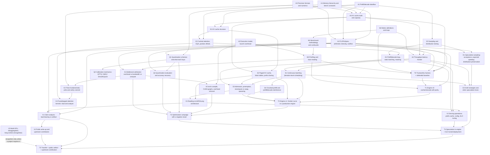

# Inference-Engineering Dependency Graph

**Design stage:** confirmed working graph; evidence-gated and revisable
**Learning phase:** Phase 0 — measurement and inference arithmetic
**Active frontier:** entry diagnostic not yet run. Every node below is `not-assessed` or `not-encoded` until `phase-0-entry-diagnostic.md` produces evidence. Do not assume the learner's deep-learning background secures any node here.

The canonical vocabulary is defined in [`CONTEXT.md`](CONTEXT.md). This document records capability prerequisites separately from teaching-order preferences and milestone integration requirements.

## Design decisions

- North star: operate and defend a single-GPU serving deployment against a declared SLO. The from-scratch engine is the **mechanism-encoding route**, not the outcome.
- Stack: PyTorch + Triton. JAX is not used here; the separation is deliberate (see leverage table).
- Bench: RTX 4090 primary, DGX Spark GB10 reserved as the changed-surface transfer measure.
- Scope bound (secondary-track dose): one small decoder-only model family, single GPU, one quantisation scheme carried to depth. Tensor/pipeline parallelism, disaggregated prefill/decode, and long-context attention variants are **recognition-level leaves** (V3) unless a project creates a reason.
- Measurement precedes optimisation. This is a sequence constraint with teeth: `T0` gates every later performance claim, because an unmeasurable system cannot be optimised, only fiddled with.

## Evidence-state legend

Node state records the strongest current evidence for the bounded capability. It is not an attempt-error diagnosis.

| State | Meaning |
|---|---|
| `not-assessed` | No current performance evidence; make no competence claim. |
| `not-encoded` | A diagnostic established that the required knowledge or procedure is absent. |
| `encoded` | The mechanism has been accurately derived or explained, but executable performance is not yet shown. |
| `scaffolded` | Correct performance was produced with a traced reference, skeleton, hints, or equivalent guidance. |
| `independent` | Correct performance was produced closed-resource on a familiar task contract. |
| `transfer` | Independent performance survived a materially changed surface or constraint. |
| `delayed-secure` | Transfer-capable performance was reproduced after the node's declared delay. |

`K/R/M/D/P/F/T/C` remain **attempt errors**. A successful remedy may change node state, but the error code itself never becomes the node state.

## Edge semantics

| Edge | Meaning | Stored where |
|---|---|---|
| Prerequisite | Target capability depends on source capability. | Mermaid graph and node table |
| Sequence constraint | Deliberate teaching order without a capability dependency. | Sequence table |
| Integration requirement | Several capabilities must be combined to satisfy a milestone. | Whole-task nodes and phase exit gates |

## Canonical prerequisite DAG

## Sequence constraints

These are teaching-order decisions, not capability dependencies. Each may be revised without claiming a logical dependency.

| Before | After | Rationale |
|---|---|---|
| M1, M2 | E1 | Measurement hygiene is taught before engine construction so that every subsequent change has a trustworthy yardstick. Building a KV cache does not logically require benchmark methodology. |
| T1, T2 | K*, Q* | Optimise a system that exists and is measured. Quantising a naive `generate` loop is technically possible and pedagogically worthless — it teaches flag-twiddling instead of attribution. |
| T2 | V1 (deep read) | Reading vLLM's scheduler after building one converts a code-reading exercise into a design comparison. Recognition-level skimming of `vllm` earlier is allowed and encouraged. |
| K3 | K4 | Write a simple kernel before analysing a hard one. |
| Q1, Q3 | Q2 | Know what quantisation buys and how to evaluate it before studying calibration algorithms; otherwise GPTQ/AWQ mechanics are memorised without a decision context. |
| D1 | D2 | Prove the distribution-preservation property before comparing draft strategies. |

## Node specification

**Fluency** means the operation must be fast and automatic, because a slow-but-correct version bottlenecks everything above it. **Familiarity** means correct-on-demand with reference material.

### A — Inference arithmetic

| ID | Node | Type | Prerequisites | Required level | Embedded retrieval / exercise | Current node state |
|---|---|---|---|---|---|---|
| A1 | Decoder-only inference dataflow: what prefill computes, what decode reuses, why the two phases have different cost structure | conceptual | — | Fluency | Draw the dataflow from memory before any engine change | `not-assessed` |
| A2 | FLOPs and bytes accounting, arithmetic intensity, roofline, MFU vs MBU | conceptual + procedural | A1, H1, H3 | **Fluency** | Predict tokens/s before every measurement | `not-assessed` |
| A3 | KV cache math: bytes per token, capacity limits, GQA/MQA effect, context-length scaling | procedural | A1, H1, H3 | **Fluency** | Compute max concurrency before configuring any server | `not-assessed` |
| A4 | Throughput–latency frontier: batch-size effect, queueing, Little's law, goodput under an SLO | conceptual + procedural | A2, A3, M2 | Familiarity → fluency in selection | Predict where the frontier bends before sweeping | `not-assessed` |

### H — Hardware model

| ID | Node | Type | Prerequisites | Required level | Embedded retrieval / exercise | Current node state |
|---|---|---|---|---|---|---|
| H1 | Memory hierarchy (HBM/L2/SMEM/registers) and the concrete constants of the 4090 and GB10 | declarative + conceptual | — | **Fluency** for the small constant table | Every napkin-math prediction | `not-assessed` |
| H2 | Execution model: SMs, warps, occupancy, kernel launch overhead, streams, CUDA graphs | conceptual | — | Familiarity | Explain a gap-dominated trace | `not-assessed` |
| H3 | Precision formats: fp32/tf32/bf16/fp16/fp8/int8/int4, accumulate types, overflow and rounding | conceptual + procedural | — | Familiarity → fluency for byte accounting | Parity tolerance selection; quantisation error reasoning | `not-assessed` |

### M — Measurement

| ID | Node | Type | Prerequisites | Required level | Embedded retrieval / exercise | Current node state |
|---|---|---|---|---|---|---|
| M1 | Benchmark methodology: workload contract, warmup, steady state, cache state, seeds, confound identification | procedural + discriminative | M2 | **Fluency** | Every measurement in the curriculum | `not-assessed` |
| M2 | Metric definitions and their traps: TTFT, TPOT/ITL, e2e, throughput, goodput, percentiles vs means | declarative + discriminative | — | **Fluency** | Metric defence before every experiment | `not-assessed` |
| M3 | Profiling: torch profiler, CUDA synchronisation semantics, Nsight Systems/Compute, trace reading | procedural + perceptual-discriminative | H2, M1 | Familiarity → **fluency** in trace reading | Identify the dominant kernel and gap structure | `not-assessed` |

### E — Engine core

| ID | Node | Type | Prerequisites | Required level | Embedded retrieval / exercise | Current node state |
|---|---|---|---|---|---|---|
| E1 | KV cache data structure: layout, dtype, preallocation, append, invariants | procedural | A1, A3 | **Fluency** | Every engine subsystem | `not-encoded` |
| E2 | Attention with cache: GQA head mapping, position/RoPE offsets, causal masking with cache | procedural | A1, E1 | **Fluency** | Parity tests after every change | `not-encoded` |
| E3 | Sampling: greedy, temperature, top-k/top-p, seeding, distribution-level testing | procedural | A1 | Familiarity → fluency | Verify speculation preserves the output distribution | `not-encoded` |
| E4 | Prefill/decode loop, static batching, padding, masking, position bookkeeping | procedural | E2, E3 | **Fluency** | Engine v0 and everything above it | `not-encoded` |

### S — Scheduling and memory management

| ID | Node | Type | Prerequisites | Required level | Embedded retrieval / exercise | Current node state |
|---|---|---|---|---|---|---|
| S1 | Iteration-level (continuous) batching: per-step admission and eviction | conceptual + procedural | E4, A4 | **Fluency** | Engine v1 scheduler loop | `not-encoded` |
| S2 | Paged KV cache: block table, allocator, fragmentation, prefix sharing / copy-on-write | conceptual + procedural | E1, A3 | **Fluency** | Memory accounting and max-concurrency claims | `not-encoded` |
| S3 | Admission control, preemption, recompute vs swap, queueing behaviour under overload | conceptual + discriminative | S1, S2, A4 | Familiarity | Explain p99 blowup under load | `not-encoded` |
| S4 | Chunked prefill; prefill/decode interference and the TTFT/TPOT tradeoff it controls | conceptual + procedural | S1 | Familiarity | Tune the interference knob against an SLO | `not-encoded` |

### K — Kernels and compute efficiency

| ID | Node | Type | Prerequisites | Required level | Embedded retrieval / exercise | Current node state |
|---|---|---|---|---|---|---|
| K1 | Bottleneck attribution: launch overhead vs memory bandwidth vs compute vs sync vs host | perceptual-discriminative | M3, A2 | **Fluency** | Every optimisation decision | `not-assessed` |
| K2 | `torch.compile`, CUDA graphs, and overhead elimination; when they help and when they do not | procedural | H2, K1 | Familiarity → fluency | Remove overhead before touching kernels | `not-encoded` |
| K3 | Triton fundamentals: write, verify, and benchmark a fused kernel against a reference | procedural | K1, H1 | Familiarity | One verified fused kernel with a parity test | `not-encoded` |
| K4 | Fused/paged attention kernels: read, analyse, and predict when they win | conceptual + discriminative | K3, E2 | Familiarity (recognition acceptable) | Explain FlashAttention's IO argument from the roofline | `not-encoded` |

### Q — Quantisation

| ID | Node | Type | Prerequisites | Required level | Embedded retrieval / exercise | Current node state |
|---|---|---|---|---|---|---|
| Q1 | Schemes and mechanisms: weight-only int8/int4, W8A8 FP8/INT8, KV-cache quantisation; effect on bytes, intensity, and capacity | conceptual + discriminative | H3, A2 | **Fluency** in selection | Predict which scheme helps this workload, and why | `not-encoded` |
| Q2 | Calibration mechanics: GPTQ, AWQ, SmoothQuant — what each actually does to the weights | conceptual | Q1 | Familiarity | Explain the salient-weight argument from memory | `not-encoded` |
| Q3 | Quantisation evaluation: accuracy recovery, task evaluation, what must be reported | procedural + discriminative | Q1, M1 | Familiarity → fluency | No quantised deployment without an accuracy result | `not-encoded` |

### D — Speculative decoding

| ID | Node | Type | Prerequisites | Required level | Embedded retrieval / exercise | Current node state |
|---|---|---|---|---|---|---|
| D1 | Speculative sampling: acceptance rate, expected speedup, why the output distribution is preserved | conceptual + procedural | A2, E3 | Familiarity → fluency for the speedup model | Predict speedup from measured acceptance rate | `not-encoded` |
| D2 | Draft strategies (draft model, n-gram/prompt lookup, trained heads) and the regimes where speculation loses | conceptual + discriminative | D1, A4, S1 | Familiarity | Explain why speculation hurts at high batch | `not-encoded` |

### V — Production stack

| ID | Node | Type | Prerequisites | Required level | Embedded retrieval / exercise | Current node state |
|---|---|---|---|---|---|---|
| V1 | Reading a production engine: vLLM/SGLang architecture, scheduler, executor, attention backend | conceptual + discriminative | S2, S3 | Familiarity → independent navigation | Locate the code implementing a behaviour you observed | `not-encoded` |
| V2 | Serving operations: prefix caching, configuration surface, SLO tuning, capacity planning | procedural + discriminative | V1, A4, M1 | **Fluency** for the tuning loop | Defend a config against a declared SLO | `not-encoded` |
| V3 | Multi-GPU parallelism, disaggregated prefill/decode, long-context attention variants | conceptual | V1 | **Recognition only** | Explain when the single-GPU story stops applying | `not-assessed` |

### X — Analysis and public artifact

| ID | Node | Type | Prerequisites | Required level | Embedded retrieval / exercise | Current node state |
|---|---|---|---|---|---|---|
| X1 | Claim analysis: separate load-bearing mechanism from benchmark artifact in a paper or vendor post | conceptual + discriminative | A2, M1, V1 | Independent | Reconstruct a published claim's contract and find what it omits | `not-assessed` |
| X2 | Public write-up and upstream contribution: reproducible report, issue, or PR | whole-task | X1 | Independent | External review that the learner does not control | `not-assessed` |

### T — Whole tasks (integration requirements, not prerequisites)

| ID | Whole task | Integration requirement | Required level | Current node state |
|---|---|---|---|---|
| T0 | Trustworthy benchmark harness and a defended baseline measurement — acceptance specification and confound self-test in [`inference-curriculum.md`](inference-curriculum.md) §T0 | A2, A3, M1, M2, M3 | Independent with checklist | `not-assessed` |
| T1 | Engine v0: KV-cached decode with numerical parity against a reference | T0, E4, M3 | Independent with fading scaffold | `not-assessed` |
| T2 | Engine v1: continuous batching + paged KV, throughput–latency frontier compared against a production engine | T1, S1–S4 | Independent | `not-assessed` |
| T3 | Optimisation campaign: one overhead/compute-level and one quantisation-level change, each with a predicted speedup, plus one pre-declared negative result | T2, K1, K2, Q1, Q3 | Independent | `not-assessed` |
| T4 | Speculation implemented in-engine with a distribution test, plus a production engine tuned to a pre-registered SLO | T3, D2, V2 | Independent | `not-assessed` |
| T5 | Transfer to a changed surface, public write-up, and one upstream contribution | T4, X1, X2 | Independent transfer | `not-assessed` |

## Recognition-level leaves

| Leaf | Why recognition is sufficient |
|---|---|
| V3: tensor/pipeline parallelism, disaggregated prefill/decode, KV offloading to CPU/NVMe | The bench is a single GPU. Knowing *when the single-GPU story stops applying* is the transferable part; the implementation detail is re-learnable on demand and would consume the whole dose. |
| Long-context attention variants (sliding window, linear/SSM hybrids, sparse KV) | Enter only if a chosen model uses them. Otherwise the arithmetic of standard attention plus the ability to read a variant's cost model suffices. |
| Engine API surface and flag inventories (vLLM/SGLang/TensorRT-LLM) | Flags change every release. The durable skill is deriving which knob to reach for from the bottleneck class, then reading the current documentation. |
| CUDA C++ kernel authoring | Triton covers the fluency target at this dose. Enter CUDA only if a Triton limitation blocks a real project need. |
| Serving-infrastructure concerns beyond one node (autoscaling, routing, multi-tenancy, cost modelling at fleet scale) | Out of scope for a single-GPU bench; revisit only if the north star changes. |

## Learner-specific leverage and blind spots

| Area | Leverage | Blind spot to guard against |
|---|---|---|
| Training/autodiff background (8 months of DL, micrograd, VJPs) | Transformer internals are already familiar; the model architecture is not the hard part here | **The single largest misconception risk in this curriculum.** Training intuitions invert at inference: there is no backward pass, batch-1 decode is memory-bandwidth-bound not compute-bound, and FLOP-reduction reasoning misleads. Treat every "this should be faster because fewer FLOPs" statement as a candidate `M`. |
| JAX and functional programming (Haskell, Elixir) | Purity, immutability, and explicit effects make the *scheduler* design legible; BEAM-style preemption and mailbox intuition maps unusually well onto continuous batching and admission control | PyTorch's inference idiom is the opposite: in-place mutation of a preallocated KV cache, aliasing, device-side state, and manual bookkeeping. Expect `P` errors from writing functional code where an in-place buffer write is required, and from assuming a returned tensor is a copy. |
| JAX `jit` and static-shape experience — including the recorded `not-encoded` gap on `jit`/`vmap` in `../q2` | Static-shape reasoning transfers directly to CUDA graphs, `torch.compile` dynamic-shape recompiles, and fixed-size block allocation | The `../q2` diagnostic recorded this exact surface as unavailable. Do **not** assume it is secure here because the concept has been named twice. Sample it explicitly in Phase 1; if it fails again, that is one gap appearing in two curricula, and it is worth a dedicated remediation rather than a second workaround. |
| Experienced programmer, comfortable building tooling | The harness, the test suite, and the reproducibility layer will be genuinely good, faster than for most learners | Strong software instincts create a specific failure here: **optimising before measuring**, and trusting a clean-looking benchmark script. The harness feeling well-engineered is not evidence the numbers are valid. `T0` exists to attack precisely this. |
| Owns the hardware (4090 + GB10) | Feedback is immediate, free, and honest; the wall clock is an uncontrolled channel that never flatters you. Two genuinely different memory hierarchies give a built-in transfer surface | Unlimited local runs invite measurement without prediction. More runs do not repair a missing arithmetic model — they hide it. The prediction-before-measurement rule is the countermeasure and is non-negotiable. |
| Runs three other curricula | Established evidence-logging habits and an existing repository pattern to reuse | This is a secondary track at 2–3 h/week. The graph is bounded on purpose; resist widening it. A gap of a week here is spacing, not neglect. |
