# Photography Dependency Graph

**Design stage:** confirmed travel-photography graph; evidence-gated and revisable
**Current learning phase and active frontier:** [`curriculum-progress.md`](curriculum-progress.md) — the only current-state store. This document owns per-node evidenced state in the tables below; it does not restate the phase or the frontier.

The canonical vocabulary is defined in [`CONTEXT.md`](CONTEXT.md). This document records capability prerequisites separately from teaching-order preferences and milestone integration requirements.

## Design decisions

- North star: arrive at an unfamiliar destination with one carryable camera kit and limited time; make, protect, edit, and defend a concise travel story under available light, access, safety, and ethical constraints.
- Domain type: **Type 2 (perceptual-motor/aesthetic) dominant**, with a **Type 3 (pattern-recognition)** component in light-reading, a small **Type 1 (hierarchical-symbolic)** sub-chain in optics and exposure, and a bounded **Type 4 (arbitrary corpus)** component in the declarative vocabulary. Knob settings differ per subgraph and are recorded in `photography-curriculum.md`.
- The graph is **flat and entangled** except for the `O` (optics) chain. In the flat regions, "prerequisite" mostly means *you cannot attend to this until that is automatic*, not *this is logically required*. Those edges are marked **attention-limited**.
- Whole tasks begin in Phase 0 and occur every week thereafter. Photography has no phase in which shooting is deferred.
- The gear decision (`G0`) is deliberately made early, cheaply, and time-boxed. It is the most analysable problem in the domain and therefore the most dangerous sink of a beginner's time.
- Camera purchase is a confirmed Phase 0 constraint. The phone still supplies the entry baseline; Phase 1 begins only after the travel-contract purchase and return-window acceptance test pass.
- Travel operations (`TR`) are explicit nodes because carrying, rapid orientation, ethical access, story coverage, data stewardship, and sequencing are part of the authentic performance rather than administrative details.
- Technical verification and perceptual judgement are tracked as separate evidence. Nodes in the `O`/`G`/`D3` and operational `TR1`/`TR5` regions can advance on machine-checked evidence; open `V`/`L`/story judgement cannot claim `transfer` without a human channel, and its ceiling is recorded explicitly below.

## Evidence-state legend

Node state records the strongest current evidence for the bounded capability. It is not an attempt-error diagnosis.

| State | Meaning |
|---|---|
| `not-assessed` | No current performance evidence; make no competence claim. |
| `not-encoded` | A diagnostic established that the required knowledge or procedure is absent. |
| `encoded` | The mechanism has been accurately explained or predicted, but executable performance is not yet shown. |
| `scaffolded` | Correct performance was produced with a checklist, prompt, demonstration, unlimited time, or tutor guidance. |
| `independent` | Correct performance was produced unaided on a familiar task contract, at the required speed where fluency is required. |
| `transfer` | Independent performance survived a materially changed subject, light condition, or constraint. |
| `delayed-secure` | Transfer-capable performance was reproduced after the node's declared delay. |

`K/R/M/D/P/F/T/C` remain **attempt errors**. A successful remedy may change node state, but the error code itself never becomes the node state.

## Edge semantics

| Edge | Meaning | Stored where |
|---|---|---|
| Prerequisite | Target capability depends on source capability. | Mermaid graph and node table |
| Attention-limited prerequisite | Target is not logically dependent, but cannot receive attention until the source is automatic. Marked `~` in the node table. | Node table |
| Sequence constraint | Deliberate teaching order without a capability dependency. | Sequence table |
| Integration requirement | Several capabilities must be combined to satisfy a milestone. | Whole-task nodes and phase exit gates |

## Canonical prerequisite DAG

```mermaid
flowchart TD
  subgraph X["Evidence discipline — cuts across all phases"]
    X1["X1 Shot-intent protocol"] --> X2["X2 Technical verification"]
    X1 --> X3["X3 Honest cull"]
    X3 --> X4["X4 Rubric self-assessment and calibration"]
    X2 --> X5["X5 Error classification"]
    X4 --> X5
  end

  subgraph O["Optics and exposure — the deep sub-chain"]
    O1["O1 Stops and light quantity"] --> O2["O2 Exposure relation"]
    O2 --> O3["O3 Metering and exposure placement"]
    O2 --> O4["O4 Aperture and depth of field"]
    O2 --> O5["O5 Shutter and motion rendering"]
    O2 --> O6["O6 ISO, noise, dynamic range"]
    O3 --> O6
    O7["O7 Focal length, angle of view, perspective"]
    O4 --> O8["O8 Focus and the plane of focus"]
    O9["O9 White balance and colour temperature"]
  end

  subgraph G["Camera operation"]
    O7 --> G0["G0 Travel-camera purchase"]
    G0 --> G1["G1 Camera fluency"]
    O2 --> G1
    O8 --> G1
    G1 --> G2["G2 Control-mode discrimination"]
    O4 --> G2
    O5 --> G2
    O6 --> G2
    G3["G3 Stance, stability, release"]
  end

  subgraph V["Seeing"]
    V1["V1 Subject identification"] --> V2["V2 Position and perspective"]
    O7 --> V2
    V1 --> V3["V3 The frame and its edges"]
    V3 --> V4["V4 Visual structure and value mass"]
    V3 --> V5["V5 Simplification and separation"]
    V4 --> V5
    O4 --> V5
    V1 --> V6["V6 Moment and timing"]
    G1 --> V6
    V4 --> V7["V7 Previsualisation"]
    O3 --> V7
    O4 --> V7
    O5 --> V7
  end

  subgraph L["Light — pattern library"]
    L1["L1 Light vocabulary"] --> L2["L2 Light reading"]
    O3 --> L2
    L2 --> L3["L3 Curated light pattern library"]
    X3 --> L3
    L2 --> L4["L4 Working with found light"]
    V2 --> L4
    L4 --> L5["L5 Hard light cases"]
    O3 --> L5
    O6 --> L5
  end

  subgraph D["Raw development"]
    O3 --> D1["D1 What a raw file contains"]
    D1 --> D2["D2 Cull and file workflow"]
    X3 --> D2
    D1 --> D3["D3 Technical correction"]
    O3 --> D3
    O9 --> D3
    D3 --> D4["D4 Tonal interpretation"]
    V4 --> D4
    D3 --> D5["D5 Colour interpretation"]
    L1 --> D5
    D4 --> D6["D6 Output and fixed-look discipline"]
    D5 --> D6
    D4 --> D7["D7 Development restraint"]
    D5 --> D7
    X4 --> D7
  end

  subgraph TR["Travel operations and story"]
    TR1["TR1 Field readiness and one-kit carry"] --> TR2["TR2 Rapid orientation and route/light/access plan"]
    TR2 --> TR3["TR3 Travel coverage and story roles"]
    TR4["TR4 Ethical access, consent, and cultural judgement"] --> TR3
    TR1 --> TR5["TR5 Data stewardship and recovery"]
    TR3 --> TR6["TR6 Sequence editing and travel-story coherence"]
    X3 --> TR6
    D4 --> TR6
    D5 --> TR6
  end

  %% cross-subgraph edges, declared after their subgraphs so nodes group correctly
  V1 --> G0
  L2 --> V7
  V1 --> TR2
  L1 --> TR2
  V2 --> TR3
  V3 --> TR3

  G0 --> TR1
  D2 --> TR5

  X1 --> T0["T0 Local micro-trip baseline"]
  V1 --> T0
  X2 --> T0

  G1 --> T1["T1 One-kit blocked outing"]
  G3 --> T1
  X2 --> T1
  O3 --> T1
  TR1 --> T1
  TR5 --> T1

  T1 --> T2["T2 Time-bounded place study"]
  V5 --> T2
  V2 --> T2
  X4 --> T2
  TR2 --> T2
  TR3 --> T2
  TR4 --> T2

  T2 --> T3["T3 Changing-condition place study"]
  L4 --> T3
  L3 --> T3
  V7 --> T3
  TR3 --> T3
  TR4 --> T3

  D6 --> T4["T4 Travel field-to-story workflow"]
  D7 --> T4
  T3 --> T4
  TR5 --> T4
  TR6 --> T4

  T4 --> T5["T5 Travel-story capstone"]
  V6 --> T5
  L5 --> T5
  G2 --> T5
  X5 --> T5
  TR1 --> T5
  TR4 --> T5
  TR5 --> T5
  TR6 --> T5
```

## Sequence constraints

These are teaching-order decisions, not capability dependencies. Each may be revised without claiming one capability logically requires the other.

| Before | After | Rationale |
|---|---|---|
| Phase 2 seeing (`V`) | Phase 3 light (`L`) | Seeing can be practised in any conditions on any outing; light work requires waiting for and returning to conditions, which is expensive at a 2–4 h/week budget. Not a dependency: `L1`/`L2` have no `V` prerequisite and are deliberately seeded early as background exposure. |
| `X3` honest cull | `D4`/`D5` interpretive development | The cull is a discrimination instrument, not a workflow step. Developing images before you can select them teaches rescuing weak frames, which is the `D7` failure mode. |
| `G0` travel-camera purchase | Phase 1 | Made early, cheaply, and time-boxed after the phone baseline. Phase 0's diagnostic is runnable before purchase; Phase 1 camera fluency is not. |
| `O` optics chain | Deep `V`/`L` work | Attention-limited, not logical: exposure decisions consume the working memory that seeing needs. This is why `G1` camera fluency is a fluency node rather than a familiarity node. |
| `D3` technical correction | `D4`/`D5` interpretation | Correction is verifiable; interpretation is not. Establish the verifiable half first so that later interpretive claims have a stable baseline. |
| `TR1` field readiness | Real-trip complexity | Readiness is established through local simulations before scarce, once-only travel conditions raise the stakes. This is teaching order, not a claim that local places are photographic prerequisites. |
| Individual-frame judgement | `TR6` sequence editing | A sequence cannot be diagnosed until the learner can cull frames against intent, but strong single-frame scores do not guarantee story coherence. |

## Node specification

`Level` is **Fluency** where automaticity is required — a slow-but-correct operation here still bottlenecks the whole task — and **Familiarity** where correctness alone suffices. `~` marks an attention-limited prerequisite.

### Evidence discipline

| ID | Node | Type | Prerequisites | Required level | Embedded retrieval / exercise | State |
|---|---|---|---|---|---|---|
| X1 | Shot-intent protocol: commit subject, depth, motion, placement, and predicted settings before the shutter | procedural | — | **Fluency** | Every frame in every outing | `not-assessed` |
| X2 | Technical verification: run and interpret the intent-versus-EXIF harness | procedural | X1 | Familiarity → fluency | Every outing debrief | `not-assessed` |
| X3 | Honest cull: select against recorded intent rather than attachment or effort | perceptual-discriminative | X1 | **Fluency** | Every outing; feeds the light library | `not-assessed` |
| X4 | Rubric self-assessment and calibration: predict scores before submitting for critique | metacognitive + procedural | X3 | **Fluency** | Every critique cycle | `not-assessed` |
| X5 | Error classification: apply `K/R/M/D/P/F/T/C` to one's own frames and outings | discriminative | X2, X4 | Fluency | Weekly error-distribution review | `not-assessed` |

### Optics and exposure

| ID | Node | Type | Prerequisites | Required level | Embedded retrieval / exercise | State |
|---|---|---|---|---|---|---|
| O1 | Stops as a doubling relation; light as a measurable quantity | conceptual + declarative | — | **Fluency** | Mental stop arithmetic before every settings prediction | `not-assessed` |
| O2 | The exposure relation: aperture, shutter, ISO as one constraint with three free variables | conceptual + procedural | O1 | **Fluency** | Predict settings; hold exposure while trading one control against another | `not-assessed` |
| O3 | Metering, exposure placement, clipping, and highlight protection | conceptual + procedural | O2 | **Fluency** | Predict the histogram before the frame; verify against the file | `not-assessed` |
| O4 | Aperture, depth of field, and its interaction with focal length and distance | conceptual + procedural | O2 | **Fluency** for common cases | Predict what will be sharp; verify by inspection at 100% | `not-assessed` |
| O5 | Shutter, subject motion, camera shake, and the limits of the reciprocal rule | conceptual + procedural | O2 | **Fluency** | Predict motion rendering; verify | `not-assessed` |
| O6 | ISO, noise, dynamic range, and the real cost of raising it | conceptual | O2, O3 | Familiarity | Defend an ISO choice against its alternatives | `not-assessed` |
| O7 | Focal length, angle of view, and the fact that perspective is set by position, not by lens | conceptual + perceptual | — | **Fluency** | Predict framing from a position before raising the camera | `not-assessed` |
| O8 | Focus modes, AF point selection, plane of focus, when to override | procedural | O4 | **Fluency** | Every frame; verified at 100% in the cull | `not-assessed` |
| O9 | White balance, colour temperature, and what raw defers | conceptual + procedural | — | Familiarity | Predict the cast; correct in development | `not-assessed` |

### Camera operation

| ID | Node | Type | Prerequisites | Required level | Embedded retrieval / exercise | State |
|---|---|---|---|---|---|---|
| G0 | Travel-camera purchase against a declared budget/carry/condition contract, followed by a return-window acceptance test | whole-task (one-off) | O7, V1 | Independent, once | Decision record, purchase, carry/control/raw/charging acceptance evidence | `not-assessed` |
| G1 | Camera fluency: change aperture, shutter, ISO, and focus mode without looking, under time pressure | procedural-motor | G0, O2, O8 | **Fluency — critical** | Timed unaided drills; measured in seconds-to-correct-settings | `not-assessed` |
| G2 | Control-mode discrimination: manual, aperture priority, shutter priority, auto-ISO — choosing which surrenders the right variable | discriminative | G1, O4, O5, O6 | Fluency | Interleaved scenario cases after `G1` is stable | `not-assessed` |
| G3 | Stance, breathing, shutter release, panning — the physical act | procedural-motor | — | **Fluency** | Handheld sharpness rate at declared shutter speeds | `not-assessed` |

### Seeing

| ID | Node | Type | Prerequisites | Required level | Embedded retrieval / exercise | State |
|---|---|---|---|---|---|---|
| V1 | Subject identification: state in one clause what the picture is about | perceptual-discriminative | — | **Fluency** | Written into every shot intent | `not-assessed` |
| V2 | Position and perspective: moving the camera as the primary compositional act | perceptual + procedural | V1, O7 | **Fluency** | Multiple positions per subject before committing | `not-assessed` |
| V3 | The frame and its edges: deliberate inclusion, exclusion, and edge behaviour | perceptual | V1 | **Fluency** | Edge check before release; verified in the cull | `not-assessed` |
| V4 | Visual structure: line, shape, value mass, balance, depth cues | perceptual + conceptual | V3 | Familiarity → fluency | Thumbnail and greyscale review of every keeper | `not-assessed` |
| V5 | Simplification and separation: making the subject legible against its background | perceptual | V3, V4, ~O4 | **Fluency** | Rubric dimension 1 and 6; reference-matching tasks | `not-assessed` |
| V6 | Moment and timing: anticipation and release | perceptual + motor | V1, ~G1 | Fluency | Sequence outings; frames-before-and-after review | `not-assessed` |
| V7 | Previsualisation: predict the rendered file before making the frame | perceptual + conceptual | V4, O3, O4, O5, L2 | **Fluency** | Committed prediction in every shot intent; scored against the file | `not-assessed` |

### Light

| ID | Node | Type | Prerequisites | Required level | Embedded retrieval / exercise | State |
|---|---|---|---|---|---|---|
| L1 | Light vocabulary: direction, hardness, contrast ratio, colour | declarative + perceptual | — | **Fluency** — this is the bounded Type 4 corpus | Named in every shot intent | `not-assessed` |
| L2 | Light reading: identify the condition and predict how it renders a given subject | perceptual-discriminative | L1, O3 | **Fluency — critical** | High-volume curated exposure; predict-then-verify | `not-assessed` |
| L3 | Curated light pattern library: personally annotated conditions and their renderings | whole-task + perceptual | L2, X3 | Independent | Built from own culled frames; reviewed for recurring gaps | `not-assessed` |
| L4 | Working with found light inside a declared opportunity window: reposition, adapt, wait, return, or reject | procedural + perceptual | L2, V2 | Fluency | Every outing; the chosen response and rejection threshold are recorded | `not-assessed` |
| L5 | Hard cases: high contrast, low light, mixed colour, backlight, flat light | discriminative | L4, O3, O6 | Independent | Interleaved once individual conditions are secure | `not-assessed` |

### Raw development

| ID | Node | Type | Prerequisites | Required level | Embedded retrieval / exercise | State |
|---|---|---|---|---|---|---|
| D1 | What a raw file contains and what it defers | conceptual | O3 | Familiarity | Explain what is and is not recoverable before editing | `not-assessed` |
| D2 | Cull and file workflow in darktable | procedural | D1, X3 | Fluency | Every outing | `not-assessed` |
| D3 | Technical correction: exposure, white balance, straightening, lens correction | procedural | D1, O3, O9 | **Fluency** | Every keeper; verifiable against clipping and geometry checks | `not-assessed` |
| D4 | Tonal interpretation: curves, local contrast, dodge and burn, value structure | procedural + perceptual | D3, V4 | Independent | Reference-matching a target rendering | `not-assessed` |
| D5 | Colour interpretation: grading, saturation versus luminance, colour relationships | procedural + perceptual | D3, L1 | Independent | Reference-matching; before/after at thumbnail | `not-assessed` |
| D6 | Output and fixed-look discipline: export, one fixed reference viewing condition | procedural | D4, D5 | Familiarity | Every published or reviewed set | `not-assessed` |
| D7 | Development restraint: distinguishing an edit that serves the intent from one rescuing a failed frame | discriminative | D4, D5, X4 | **Fluency** | Committed intent compared with the edit actually applied | `not-assessed` |

### Travel operations and story

| ID | Node | Type | Prerequisites | Required level | Embedded retrieval / exercise | State |
|---|---|---|---|---|---|---|
| TR1 | Field readiness and one-kit carry: preflight, packed-to-first-frame fluency, power/media/weather/security fallback, and carry-envelope discipline | procedural + operational | G0 | **Fluency — critical before travel** | Every camera outing starts packed and records readiness failures | `not-assessed` |
| TR2 | Rapid orientation: bound scouting time; read light, subject flow, access, safety, route, and one story question | perceptual + procedural | V1, L1, TR1 | **Fluency** | First minutes of every unfamiliar-place outing | `not-assessed` |
| TR3 | Travel coverage: make non-redundant orientation, context, human, detail, transition, and closure candidates as the story requires | perceptual + whole-task | TR2, TR4, V2, V3 | Independent | Coverage-role commitment and missing-role review on every outing; `V6` deepens moment coverage later | `not-assessed` |
| TR4 | Ethical access: discriminate public/unobtrusive, explicit-consent, non-identifiable, prohibited, unsafe, exploitative, and culturally sensitive cases | discriminative + procedural | — | **Independent discrimination — critical; destination-specific facts rechecked** | Pre-capture decision for people/sensitive contexts; recorded non-captures | `not-assessed` |
| TR5 | Data stewardship: verified ingest, two independent copies before card reuse, metadata preservation, and recovery from one failed destination | procedural | TR1, D2 | **Fluency — critical** | Every camera outing; recovery drill once per Phase 4 macrocycle | `not-assessed` |
| TR6 | Sequence editing: answer one story question through necessary frame roles, order, pacing, variation, coherence, factual context, and disciplined omission | perceptual + procedural | TR3, X3, D4, D5 | Independent | Travel-story rubric, blind re-sequence, caption/context check, and mandatory-cut exercise | `not-assessed` |

### Whole tasks

| ID | Node | Type | Prerequisites | Required level | Integration requirement | State |
|---|---|---|---|---|---|---|
| T0 | Local micro-trip baseline: unfamiliar place, phone, intent and coverage role recorded, 5–7 frame edit | whole-task | X1, X2, V1 | Scaffolded | X1 + X2 + V1 + scaffolded story-question/coverage baseline | `not-assessed` |
| T1 | One-kit blocked outing: packed bag to first frame, verified capture, two-copy ingest | whole-task | G1, G3, X2, O3, TR1, scaffolded TR5 | Independent | G1 + G3 + O3 + X1–X2 + field readiness | `not-assessed` |
| T2 | Time-bounded place study: reference-matching subset plus 6–8 frame unfamiliar-place edit | whole-task | T1, V2, V5, X4, TR2, TR3, TR4 | Independent on a changed surface; open perceptual transfer unvalidated | Seeing + rapid orientation + ethical coverage + set edit | `not-assessed` |
| T3 | Changing-condition place study: story coverage across light/flow with waiting, returning, or rejecting | whole-task | T2, L3, L4, V7, TR3, TR4 | Independent on a changed surface; open perceptual transfer unvalidated | Light + moment + story continuity under change | `not-assessed` |
| T4 | Travel field workflow: capture to two-copy ingest to developed 6–10 frame sequence within 48 hours | whole-task | T3, D6, D7, TR5, TR6 | Independent | D3–D7 + X4 + data stewardship + sequence | `not-assessed` |
| T5 | Travel-story capstone: 10–12 frames, one carryable kit, unfamiliar destination, deadline, defended | whole-task | T4, V6, L5, G2, X5, TR1, TR4, TR5, TR6 | Independent on a changed surface; open perceptual transfer requires an external channel | Entire graph under travel constraints | `not-assessed` |

## Recognition-level leaves

Leave these at recognition. Investigate only when an active whole task supplies a reason.

| Leaf | Why recognition is sufficient |
|---|---|
| Sensor technology, lens design, and optical formulae beyond depth of field and angle of view | Explains behaviour you can already predict and verify empirically. Adds no decision capability. |
| Flash and strobe systems | Out of scope for an available-light north star. Becomes a real subgraph only if a later project requires it. |
| Camera-brand ecosystems and comparative gear analysis | The most analysable and least valuable problem in the domain. `G0` closes this question once, deliberately. |
| Colour-management theory beyond one fixed reference viewing condition | Only needed at print or delivery scale; a single fixed reference is sufficient to make critiques comparable. |
| Film, alternative process, and historical technique | Genuine domains, but not prerequisites for this north star. |
| Named compositional "rules" as a system | `V1`–`V5` teach the underlying perceptual jobs. Rule inventories are a `C`-tier substitute for looking. |
| Destination shot lists and social-media “must photograph” lists | Coverage roles and a story question guide observation without replacing it with checklist tourism. Research only safety, access, timing, and cultural context needed for the actual trip. |

## Learner-specific leverage and blind spots

| Area | Leverage | Blind spot to guard against |
|---|---|---|
| Experienced programmer; builds tooling readily | The `X` evidence-discipline subgraph will be built well and actually used. Machine-checked technical verification is the strongest feedback channel in this plan and it exists because it is cheap for this learner. | Building and refining the harness is *not* photographic practice. Tooling work is capped in the weekly allocation for exactly this reason. |
| Running a parallel Type 1 ML curriculum with strong predict-then-check discipline | Calibration, committed predictions, and error-code classification transfer directly and are already habitual. | Type 1 methods applied to a Type 2 domain produce someone who can discuss photography and cannot photograph. Reading, systematising, and note-taking must not displace shooting hours. |
| Comfortable with formal structure and explicit criteria | Fixed rubrics and binary gates will be respected rather than quietly relaxed. | Numbers from the AI rubric will *feel* like ground truth because they are numeric. They are not. Only the `X2` harness output is ground truth. |
| Technical aptitude | The `O` and `G` subgraphs will likely move fast, possibly much faster than the phase structure assumes. | Fast technical competence is the classic false summit here. `O`/`G` reaching `independent` while `V`/`L` sit at `encoded` is the predicted failure signature, and the Phase 2 gate exists to catch it. |
| Camera purchase committed, no camera yet | The purchase can follow the phone baseline plus first-pass `V1`/`O7`, so the contract is grounded in actual use. | Gear research expanding to fill the time available. `G0` is time-boxed and exits only with a purchase plus acceptance test. |

## Feedback-integrity ceiling

This must be stated on the graph itself, because it caps what several nodes can ever claim.

| Node region | Ground truth available | Maximum defensible state without a human channel |
|---|---|---|
| `O`, `G`, `D3`, `X1`–`X2` | Machine-checked: EXIF versus intent, computed depth of field, clipping, focus at 100%, geometry | `delayed-secure` — fully attainable |
| `TR1`, `TR5` | Timed readiness, carry weight, explicit preflight, file counts/hashes, two-copy verification, and recovery drill | `delayed-secure` — fully attainable |
| `TR4` | Law/access facts where knowable plus recorded consent and decision process; cultural or harm judgement still needs an external channel | `independent`; technical protocol can be secure, open ethical judgement cannot claim transfer alone |
| `V5`, `V7`, `D4`, `D5` on reference-matching tasks | Measured deviation from a specified target, per [`rubrics/reference-matching-protocol.md`](rubrics/reference-matching-protocol.md) | `transfer` — attainable **only through a task satisfying that protocol's three properties**, and only on the dimension actually matched. `D4`/`D5` additionally require the `RM-R` tooling; until it exists they are capped at `independent` like any other open perceptual node |
| `V1`–`V4`, `V6`, `L3`–`L5`, `D7`, `TR2`–`TR3`, `TR6` on open work | None. Fixed-rubric AI critique plus committed self-prediction only | `independent` — capped. Claiming `transfer` on open perceptual or story work requires a feedback channel the learner does not control |

The cap is lifted by adding any one of: a critique community, a local club or class, a mentor, print review, or juried submission. `photography-curriculum.md` names the trigger that should prompt adding one.
