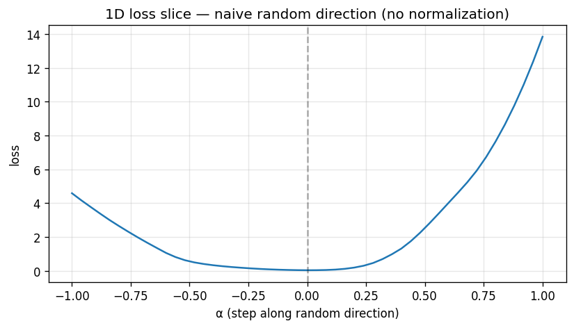
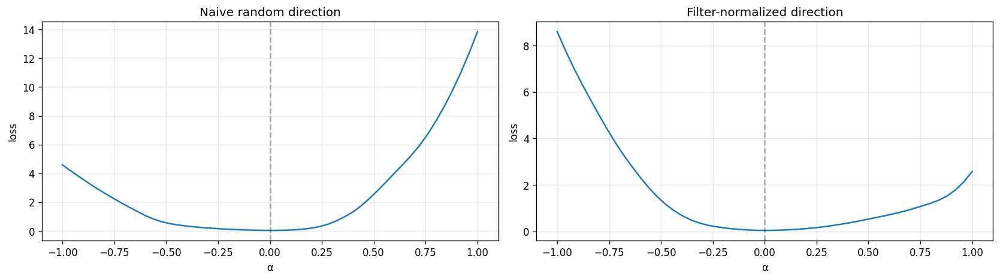
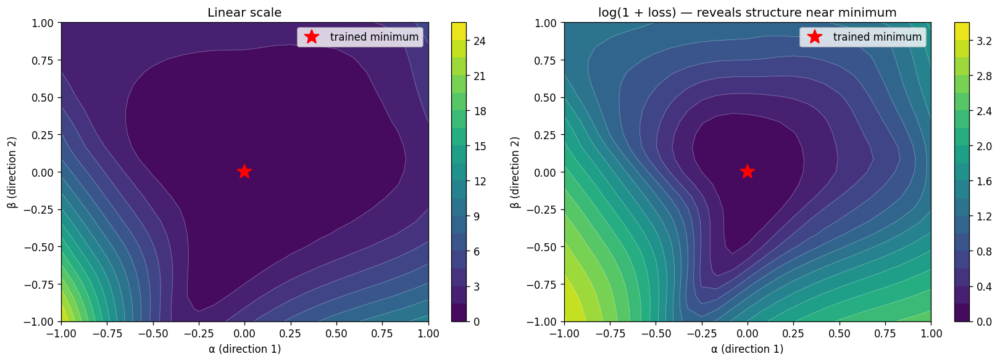

# Week 10 Session 2 - Landscape Visualization

In this session I used the two moons problem as an example dataset for visualizing loss landscapes and motivating filter normalization. I began by training and plotting the loss for a naive network with a 1D slice:

```
def loss_slice_1d(flat_center, schema, X, y, direction, alphas):
    """Evaluate loss at center + alpha * direction for each alpha."""
    return np.array([forward_loss_np(flat_center + a * direction, schema, X, y)
                     for a in alphas])

# Use the SGD-trained model as the center
rng = np.random.default_rng(0)
direction_naive = rng.standard_normal(len(flat_sgd))   # N(0, I), no normalization
alphas = np.linspace(-1.0, 1.0, 51)

losses_naive = loss_slice_1d(flat_sgd, schema, X, y, direction_naive, alphas)

import matplotlib.pyplot as plt
plt.figure(figsize=(8, 4))
plt.plot(alphas, losses_naive)
plt.axvline(0, color='k', linestyle='--', alpha=0.3)
plt.xlabel("α (step along random direction)")
plt.ylabel("loss")
plt.title("1D loss slice — naive random direction (no normalization)")
plt.grid(alpha=0.3)
plt.savefig("w10_1d_slice_naive.png", dpi=120, bbox_inches='tight')
plt.show()
```



From this I observe that the curve seems to be flattened at the zero, around zero. It does curve upwards in both the positive and negative directions, with a steeper curve in the positive direction making it not symmetrical. The loss at $\alpha = +1$ is 14 which is _huge_ giving a worse result than just random predictions. If we take a step in a random direction it would trigger a very large perturbation, the random direction dominating the small weights of the trained network.

## Filter normalization

To address this scaling problem, we can apply filter normalization:
For each output unit j (each row of $W_j$):
$D_l \left[ j,: \right] \gets D_l \left[ j,: \right] \cdot \frac{\left\| W_l[j,:] \right\|}{\left\| D_l[j,:] \right\|}$
and zero the biases. Here's the code:

```
def filter_normalize(direction_flat, params_flat, schema):
    """
    Rescale `direction_flat` per-filter to match the per-filter norms of `params_flat`.
    Bias entries in direction are set to zero.
    Returns a new flat array (same shape as direction_flat).
    """

    flat = []
    cursor = 0

    for layer in schema:
        (n_out, n_in) = layer["W_shape"]
        n_w = n_out * n_in
        (b_shape,) = layer["b_shape"]

        W = params_flat[cursor : cursor + n_w].reshape(n_out, n_in)
        W_norms = np.linalg.norm(W, axis=1, keepdims=True)
        D = direction_flat[cursor : cursor + n_w].reshape(n_out, n_in)
        D_norms = np.linalg.norm(D, axis=1, keepdims=True) + 1e-10
        cursor += n_w
        D = D * W_norms/D_norms
        flat.append(D.flatten())
        b = params_flat[cursor : cursor + b_shape]
        b = np.zeros_like(b)
        cursor += b_shape

        flat.append(b)

    return np.concatenate(flat)
```

Then we can compare the 1D slices with a graph: 
Here we see a much better loss at $alpha=\pm 1$ with loss at $alpha=+1$ $~2.5$. which is a result of not just fixing the scaling by shrinking the direction, but directions in small-norm filters no longer receive disproportionately large perturbations relative to the trained weights. The graph is still not symmetric, but is less extreme.

## 2D Slice

Next is plotting in 2D, by selecting two of the directions and looking at the contour plot. First getting the 2D slice:

```
def loss_slice_2d(flat_center, schema, X, y, d1, d2, alphas, betas):
    """Evaluate loss at center + alpha*d1 + beta*d2 over a grid."""
    losses = np.zeros((len(alphas), len(betas)))
    for i, a in enumerate(alphas):
        for j, b in enumerate(betas):
            losses[i, j] = forward_loss_np(
                flat_center + a * d1 + b * d2, schema, X, y
            )
        if i % 5 == 0:
            print(f"  row {i+1}/{len(alphas)}")
    return losses

# Two independent random directions, each filter-normalized
rng = np.random.default_rng(0)
d1_naive = rng.standard_normal(len(flat_sgd))
d2_naive = rng.standard_normal(len(flat_sgd))

d1 = filter_normalize(d1_naive, flat_sgd, schema)
d2 = filter_normalize(d2_naive, flat_sgd, schema)

# Grid: 25x25 = 625 evaluations. At ~0.04s each, ~25s total.
alphas = np.linspace(-1.0, 1.0, 25)
betas  = np.linspace(-1.0, 1.0, 25)

print("Computing 2D slice...")
losses_2d = loss_slice_2d(flat_sgd, schema, X, y, d1, d2, alphas, betas)
print(f"Done. Loss range: [{losses_2d.min():.4f}, {losses_2d.max():.4f}]")
```

Now the plot:

```
A, B = np.meshgrid(alphas, betas, indexing='ij')

fig, axes = plt.subplots(1, 2, figsize=(14, 5))

# Linear scale
cs1 = axes[0].contourf(A, B, losses_2d, levels=20, cmap='viridis')
axes[0].contour(A, B, losses_2d, levels=20, colors='white', alpha=0.3, linewidths=0.5)
axes[0].plot(0, 0, 'r*', markersize=15, label='trained minimum')
axes[0].set_xlabel('α (direction 1)')
axes[0].set_ylabel('β (direction 2)')
axes[0].set_title('Linear scale')
axes[0].legend()
plt.colorbar(cs1, ax=axes[0])

# Log scale (log(1 + loss) to handle near-zero values)
cs2 = axes[1].contourf(A, B, np.log1p(losses_2d), levels=20, cmap='viridis')
axes[1].contour(A, B, np.log1p(losses_2d), levels=20, colors='white', alpha=0.3, linewidths=0.5)
axes[1].plot(0, 0, 'r*', markersize=15, label='trained minimum')
axes[1].set_xlabel('α (direction 1)')
axes[1].set_ylabel('β (direction 2)')
axes[1].set_title('log(1 + loss) — reveals structure near minimum')
axes[1].legend()
plt.colorbar(cs2, ax=axes[1])

plt.tight_layout()
plt.savefig("w10_2d_slice_sgd.png", dpi=120, bbox_inches='tight')
plt.show()
```

Here is the plot: 
The lower bound of the loss range shows the trained loss at the center, and the upper bound is the worst case when we have $\alpha = \beta = 1$, a compounded perturbation with 2D over 1D. The shape is elongated, the loss still grows faster in one direction over the other, and is asymmetric, so the structure is non-quadratic.

## What you can and cannot claim

These graphs are just a few slices of a larger dimensional space. We can make claims about these particular slices, but not the entire space.

## Open follow ups

- Does the same flat_adam produce a similar plot?
- Are the eigenvalues of the projected Hessian computable?
