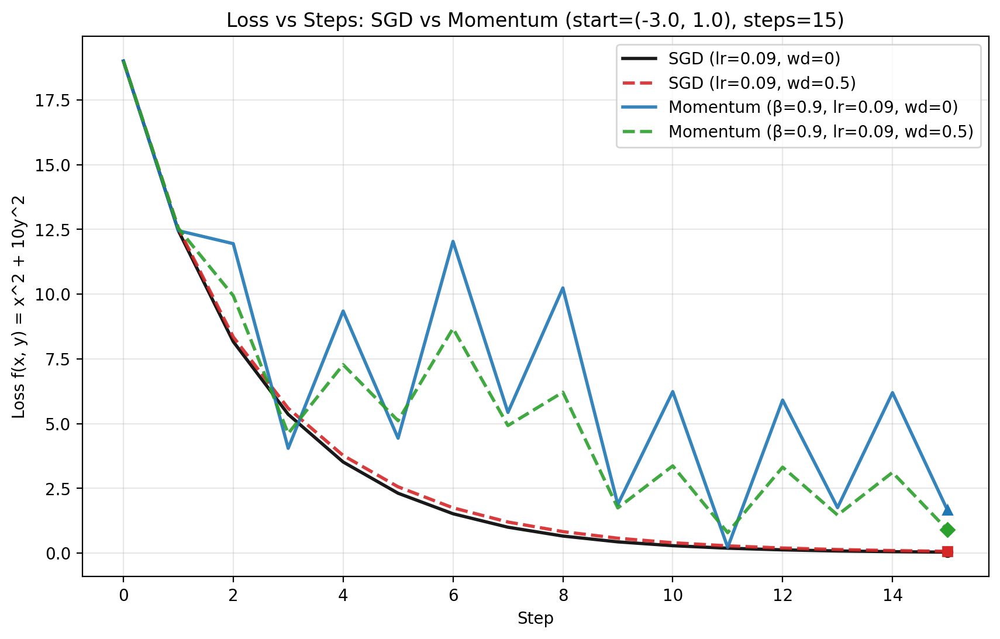

# Week 8 Session 2

The full code for this session is in:
[SGD and MomentumSGD with decay](w8s2.py)
[Eval loop with train/val splits](w8s2-1.py)

## L2 Regularization

The first exercise is adding L2 regularization otherwise known as weight decay to the stochastic gradient descent code.

```
class MomentumSGD(Optimizer):
    def __init__(self, learning_rate, beta, weight_decay=0.0):
        self.learning_rate = learning_rate
        self.beta = beta
        self.vx_prev = 0
        self.vy_prev = 0
        self.weight_decay = weight_decay

    # Taking a step using Momentum GD for the function z=x^2 + 10*y^2
    # Currently velocity state is hardcoded, I should generalize
    # TODO: Replace point with a list length d and use tuple from grad_f, v_prev should be a list
    def step(self, point, grad_f):
        (x, y) = point
        (dzdx, dzdy) = grad_f(x, y)
        vx = self.beta * self.vx_prev + dzdx
        vy = self.beta * self.vy_prev + dzdy
        self.vx_prev = vx
        self.vy_prev = vy
        new_x = (1-self.learning_rate*self.weight_decay)*x - self.learning_rate * vx
        new_y = (1-self.learning_rate*self.weight_decay)*y - self.learning_rate * vy
        return (new_x, new_y)
```

### Loss curves

Here are plots showing the lost curves using the four different scenarios.


## Train / Val splits

The second exercise was to create a split of training and validation data and use that to both train and validate the loops. This was done in the higher level code building on `w6s2.py`:

```
def val_accuracy(mlp, val_set):
    results = []
    for x, y in val_set:
        results.append(y == predict(x, mlp))
    return sum(results) / len(results)

def main():
    random.seed(42)
    TRAIN_DATA = [
        ([-2.0, -1.0], 0),
        ([-1.5, -1.2], 0),
        ([0.0, 2.0], 1),
        ([0.5, 1.8], 1),
        ([2.0, -1.0], 2),
        ([1.5, -1.3], 2),
    ]
    VAL_DATA = [
        ([-2.2, -0.8], 0),
        ([-0.5, 2.2], 1),
        ([2.2, -0.7], 2),
    ]

    xs = [x for x, _ in TRAIN_DATA]
    ys = [y for _, y in TRAIN_DATA]

    layers = [create_layer(2, 4), create_layer(4, 4, non_lin="None")]
    for layer in layers:
        print(layer)
        print(layer.neurons)
        print()
    mlp = MLP(layers)


    for i in range(1, 5):
        print(f"\n== Run number {i} ==")
        loss = mini_batch(mlp=mlp, xs=xs, ys=ys)
        print(f"== loss: {loss} ==\n")
        print(f"--accuracy: {val_accuracy(mlp, VAL_DATA)}")

```

## Observations

Weight decay helped with momentum SGD to tame the overshooting effect of high momentum by pulling the weights towards zero. It did not have a strong effect on vanilla SGD, since the ravine jumping is not something that pulling towards zero affects, it doesn't affect the path as much as the destination. In both cases I saw the decay roughly halved the norm by the end of the run.
