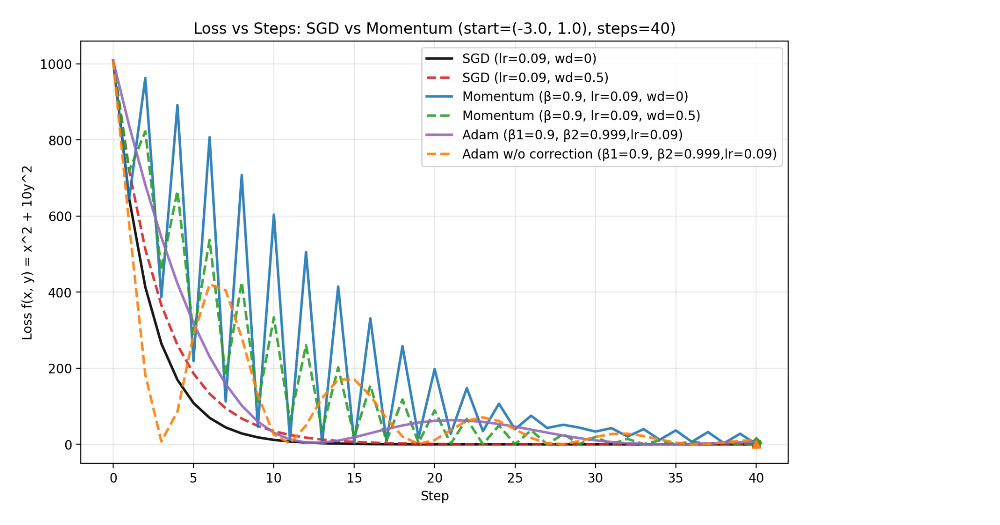

# Week 9 Session 2 - Adam code

## Code

```python
class Adam(Optimizer):
    def __init__(self, learning_rate, beta1, beta2, epsilon, correction=True):
        self.learning_rate = learning_rate
        self.beta1 = beta1
        self.beta2 = beta2
        self.epsilon = epsilon
        self.m = (0.0,0.0)
        self.v = (0.0,0.0)
        self.correction=correction
        self.step_counter = 1

    def step(self, point, grad_f):
        (x, y) = point
        (dzdx, dzdy) = grad_f(x, y)
        (mx,my) = self.m
        (vx,vy) = self.v
        mx = self.beta1 * mx + (1-self.beta1)*dzdx
        my = self.beta1 * my + (1-self.beta1)*dzdy
        vx = self.beta2 * vx + (1-self.beta2)*dzdx**2
        vy = self.beta2 * vy + (1-self.beta2)*dzdy**2
        self.m=(mx,my)
        self.v=(vx,vy)
        mx_hat = mx
        my_hat = my
        vx_hat = vx
        vy_hat = vy
        if self.correction:
            mx_hat = mx / (1 - self.beta1 ** self.step_counter)
            my_hat = my / (1 - self.beta1 ** self.step_counter)
            vx_hat = vx / (1 - self.beta2 ** self.step_counter)
            vy_hat = vy / (1 - self.beta2 ** self.step_counter)

        new_x = x - (self.learning_rate * mx_hat)/(np.sqrt(vx_hat) + self.epsilon)
        new_y = y - (self.learning_rate * my_hat)/(np.sqrt(vy_hat) + self.epsilon)
        self.step_counter += 1
        return (new_x, new_y)
```

## Graph

Comparison with SGD, Momentum, Adam



## Observations

SGD still performs very well here, even with a large ||(\kappa||) value since the problem is simple. However, Adam is more robust w/r/t learning rate and has less oscillation than the momentum implementations which begin to oscillate heavily with large ||(\kappa||). Removing the bias correction shows much stronger oscillation in the beginning, until around step 20 when the two Adam graphs converge. This is due to the small values of ||(\sqrt{v_1}||) in the denominator early on causing large steps and overshooting the ravine. I also tried adjusting the size of $\epsilon$ as an ablation, but given the large gradients it didn't have much effect. It would be more likely to impact a problem with a flat region or sparse gradients.
