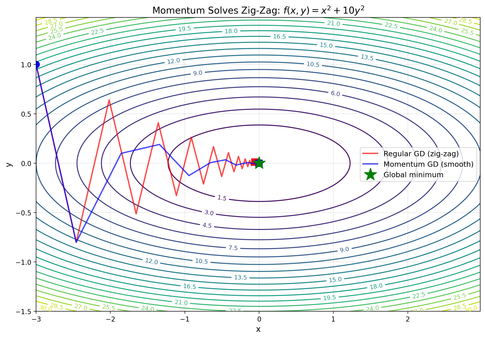

# Week 2 Session 3 Writeup

Backpropagation is a specific algorithm that implements reverse mode autodifferentiation and is used to find the gradients for parameters in a neural network. It operates on a computational graph (a directed acyclic graph), caching the intermediate activations during the forward pass (essentially a composition of functions). Once the forward pass is complete, backprop uses the chain rule and reverse topological ordering of the graph to calculate the derivatives of the final output with respect to the intermediate nodes and parameters of the network in a single backward pass by pushing the adjoints (sensitivities with respect to loss). The adjoints are pushed at each node by multiplying the upstream gradient by the local Jacobian (calculated using the cached activations). This leverages the Vector-Jacobian Product (VJP), making reverse mode efficient when there's a single scalar output (loss) and high-dimensional parameter space. The scalar loss starts the backward pass with an initial adjoint $\frac{\partial L}{\partial L} = 1.0$. The VJP avoids constructing the full Jacobian. For element-wise operations, the Jacobian is diagonal, so the VJP reduces to a Hadamard product; for matmul, closed-form expressions can be used to avoid explicit Jacobian construction. Mathematically, the forward pass composes functions to produce the output, while the backward pass composes their adjoint linearizations. In comparison, forward mode autodiff would require a pass for every parameter.

Backpropagation is reverse-mode automatic differentiation of a scalar functional defined by a composition of functions, implemented by composing adjoint linearizations in reverse topological order.

Adjoint: in practical terms it is the transpose, which we end up using that because we are moving backward:
Linear map: A: V -> W
Adjoint: A^_: W^_ -> V^_
A pushes vectors forward
A_ pull gradients (covectors) backward

Forward mode uses J_f x
Reverse mode uses x=J_f^T y

Each node:
𝑥 → 𝑓 𝑦 x f ​ y

induces two maps:

Forward: 𝑓 ∗ : 𝑇 𝑥 → 𝑇 𝑦 f ∗ ​ :T x ​ →T y ​

Backward: 𝑓 ∗ : 𝑇 𝑦 ∗ → 𝑇 𝑥 ∗ f ∗ :T y ∗ ​ →T x ∗ ​

Backprop computes: ∂ 𝐿 ∂ 𝑥 = 𝑓 ∗ ( ∂ 𝐿 ∂ 𝑦) ∂x ∂L ​ =f ∗ ( ∂y ∂L ​)

<https://chatgpt.com/s/t_6972d09aa53c8191aedd186a48f70a19>

VJP: when using multivariate chain rule with a single output, we can use VJP to find the gradients more efficiently than calculating the full Jacobian which would be sparsely populated. With a single output the Jacobian becomes a row vector and the gradient of the weights is the outer product of the upstream gradient and the input:
$$ \nabla_W L = J_W^T \cdot (\nabla_y L) $$

Where y is the output, $\nabla_yL$ is the upstream gradient (signal of sensitivity of loss to output), $J_W = \frac{\partial y}{\partial W}$ is the Jacobian representing the local sensitivity of the layer.

For a linear layer this can be made more efficient with an outer product that avoids calculating the actual Jacobian:
$$ \nabla_W L = (\nabla_y L)x^T$$
This effectively calculates the numerical result of $J_W^T v$ where v is $\nabla_y L$ without building the actual Jacobian.

Clarificaion:
Neilsen refers to "error" as a more physical and historical reference to what is mathematically the adjoint. Backprop and NN predate autodiff theory, and error is a bit more intuitive but mathematically it is a cotangent vector/sensitivity being passed as an ajdoint. In his terms the \delta "error" is the adjoint

# Week 3 updates

## $\delta$ notation

Tracks the computed gradient of the loss with respect to a specific node (typically its pre-activation). It is a convenient way to organize the gradients with respect to the inputs/weights.

## Edges carry derivatives

Each edge between nodes defines the derivative mapping of the one node's output to the next node's input. The adjoints of these are used to pullback the gradient from the output to earlier nodes. During the forward pass the value of the node is cached which can then be used to calculate the local gradients without forming the full Jacobian. Instead the VJP allows direct computation from the covector (ajdoint) and the cached local values.

## VJP vs full Jacobian

Reverse mode is efficient for a scalar loss because it uses vector–Jacobian products (VJPs) to propagate gradients backward. Since the loss is scalar, the adjoint at the output is a single covector, which can be pulled back through the network in one backward pass. This avoids constructing full Jacobians and allows all parameter gradients to be computed in a single reverse traversal of the graph.

The VJP is a linear map, not a matrix. It takes a vector v (seed) and returns the product $v^T J$ without building the Jacobian:

- Input: $v \in \mathbb{R}^m$
- Operation: $v^T J$ (or $J^T v depending on convention)
- Output: vector in $\mathbb{R}^n$

From a code perspective it is a closure, not a matrix.

# Week 4 Updates

## Gradients are covectors

- $df_x: \mathbb{R}^n \to \mathbb{R}$ is the derivative at x, and is a covector: a linear map that maps a tangent vector to scalar.
- The gradient is the vector representation of the covector after choosing an inner product.
- ML Libraries hide this fact by implicitly identifying covectors with vectors using a fixed inner product. This makes the derivatives represented as gradients, and the action on tangent vectors as dot products.

## Why gradients point "uphill"

- Gradients are normal to level sets since their inner product with the tangent vectors to the level set is zero. This makes the gradient point "uphill" in the direction of steepest ascent away from the level set. The definition of "uphill" is dependent on the metric and choice of inner product. A different metric would result in a different "steepest" direction.

## Why gradient descent works

- Once we know that the gradient is normal to the level set, then it is giving the direction of the steepest ascent. In gradient descent we reverse the sign to get the steepest descent, and multiply by a small learning rate to take small steps along the normal.

## Where choices sneak in

- Inner products - The covector $df_x$ is metric-independent. But to get a vector representation (the gradient) we need to choose an inner product. The choice of inner product will define what direction is the 'steepest'. Here we are using the Euclidean inner product which gives the standard gradient $\nabla f$. If we choose a different inner product, the resulting vector would still be 'steepest ascent' but relative to a different metric. So gradient descent under the Euclidean metric isn't _the_ steepest descent - it's steepest descent _relative to one particular choice of metric_.
- Parameterization - Choice of parameterization defines the coordinate system of the optimization space which affects the forward pass computations, and how the sensitivity is calculated in the backward.
- Scaling - Choosing a learning rate affects how much we scale the descent, which can either lead to slow convergence, or divergence. The learning rate keeps things in the region where the first order approximations we are making are valid.

## Summary

Gradients are covectors; optimization is about which tangent directions are allowed and how we measure “steepest.”

## Extra clarification on covector, gradient and inner product

The covector is fixed, the choice is the inner product (metric), and the gradient vector is the result of that choice.
If you change the metric:

- $df_x$ stays the same
- the gradient vector changes
- the "steepest" direction changes

- The covector asks: "How does the function change if I move in direction $v$?"
- The metric answers: "What does it mean for one direction to be steeper than another?"
- The gradient is the direction that best answers both questions simultaneously

### Fixed vs chosen

#### Fixed

- The function $f(x)$
- The derivative $df_x: T_x \to \mathbb{R}$ (a covector)

#### Chosen

- An inner product $\langle \cdot, \cdot \rangle_x$ on the tangent space
- Equivalently a metric $g(x)$: $$df_x(v) = g(\nabla f(x), v) = \langle \nabla f(x), v \rangle_x$$

The choice says how to:

- Measure lengths
- Measure angles
- Convert covectors into vectors

#### Induced (not chosen)

- The gradient vector $\nabla f(x)$
- Once the metric is fixed, the gradient is fixed

# v0.4 Week 5

## GD as constrained optimization

GD can be viewed as an optimization problem to find the minimum of the linear Taylor approximation of $f$ under a norm constraint:

$$
min_{||\Delta x||_2 \leq \epsilon} df_x (\Delta x)
$$

A linear function over an unconstrained space has no minimum, we need the constraint on $\Delta x$ to prevent the gradient growing towards negative infinity. We arrive at this constrained optimization problem from taking the Taylor expansion of GD, using a linear approximation for the function, then realizing that the derivative is the part of the equation we can optimize.

## Metric Dependence of "steepest"

To determine the steepness we need a metric to define how we measure our steps. The derivative $df_x$ is a covector. To express it as a gradient vector we must choose an inner product which will provide this metric. For instance we can use the Euclidean norm, which is how we end up using the dot product to produce a gradient for the covector.

## Visual intuition for ravines

When the condition number $\kappa = \frac{\lambda_{max}}{\lambda_{min}}$ is large, then it indicates there are steep sides to the graph of level sets, creating oval shaped level sets in 2D which can be thought of as ravines. Steep and narrow ravines negatively affect how we take steps when following GD by causing the steps to jump back and forth across in a zigzag, flipping the sign of the step each time. A large eigenvalue corresponds to the steep curvature direction. Since GD has a single global step size, if we choose a good learning rate for the shallow valley it will be too large for the narrow ravine.

## Summary

The derivative $df_x$ is naturally a covector that takes a tangent vector $\Delta x$ and returns the directional derivative. It is not in the same space as displacement vectors. To express this covector as a gradient vector $\nabla f(x)$, we must choose an inner product. The inner product provides an identification between vectors and covectors (via the Riesz representation theorem), allowing us to write:

$$
df_x(\Delta x) = \langle \nabla f(x), \Delta x \rangle
$$

Different choices of inner product (metric) produce different gradient vectors representing the same covector. The direction of “steepest descent” depends on the metric. Changing the metric changes the mapping from a covector $df_x$ to a gradient vector $\nabla f$, which changes the descent direction.

# Week 6 (v0.5): Momentum: smoothing and dynamics

Adding momentum to [[Gradient Descent]] adds a 'history' of previous gradients that cancels out the oscillations when there is a high condition number (i.e. narrow ravine). Momentum is an [[Exponential Moving Average]] so it averages out the sign flipping while the velocity in the more consistent direction accumulates.

With the graph above you can compare how vanilla GD is oscillating back and forth, but when we add momentum it follows a much smoother and more direct path. The higher the momentum $\beta$ the more it will dampen the oscillations up to a point.

This is analogous to the path a heavy ball will take vs a lighter one. With a heavier ball there is more momentum that will carry the velocity forward along the axis of the valley. Mathematically the heavy-ball recurrance is defined as:

$$
v_{t+1} = \beta v_t + \nabla f(x_t)
x_{t+1} = x_t - \alpha v_{t+1}
$$

We can unroll this to expose how momentum is an EMA, for example for $v3$:

$$
\begin{aligned}
v_3=\beta(\beta(\beta v_0 + \nabla f(x_0)) + \nabla f(x_1)) + \nabla f(x_2)) \\
=\beta^3 v_0 + \beta^2 \nabla f(x_0) + \beta^1 \nabla f(x_1) + \beta^0 \nabla f(x_2)
\end{aligned}
$$

Since $0<\beta<1$ we weigh the more recent values more heavily than the older ones and the gradient components along the high-curvature eigendirection tend to cancel out because they flip sign while the consistent component accumulates.

## Failure modes

- If \beta is too small, we get close to vanilla GD, so it will still zig-zag on ill conditioned problems.
- If \beta is too large it will be slow to respond to new gradient information.

## Rules of Thumb

- Typically start with $\beta=0.9$ then adjust
- If it explodes adjust LR first, then $\beta$
- If it crawls increase LR slightly or reduce $\beta$
