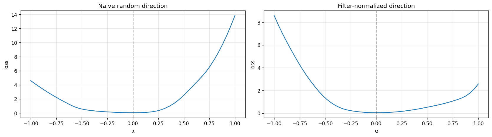
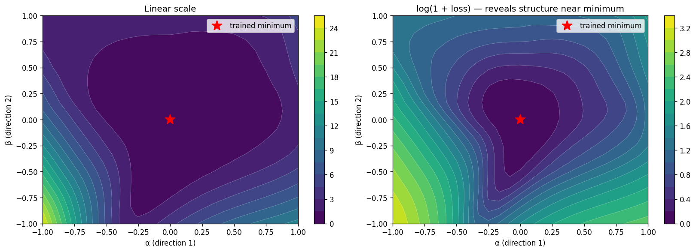

# Week  10 Session 4 - Writeup

## 1. Local Geometry and the Hessian

First we break down the function with a Taylor expansion around a minimum, which can the expose the local geometry and [[Hessian]]. From there we can find per-direction parabolas for each eigenvalue that will later be graphed.

Beginning with a multivariate Taylor expansion of $f(w+\Delta w)$ around point $w$:

$$
f(w+\Delta w) = f(w) + \nabla f(w)^T \Delta w + \frac{1}{2} \Delta w^T H \Delta w
$$

At a minimum $\nabla f(w^*) = 0$, so the first-order (gradient) term vanishes and the second-order term dominates, so the local geometry near $w^*$ is governed by the Hessian.

Since the Hessian matrix is symmetric, by the [[spectral theorem]] the [[eigenvalue]]s are real and the [[eigenvector]]s are [[orthogonal]].

$$
H = Q \Lambda Q^T \\
u = Q^T \Delta w \\
$$

$$
\frac{1}{2} \Delta w^T H \Delta w \\
\frac{1}{2} \Delta w^T Q \Lambda Q^T \Delta w
$$

Substituting $u=Q^T \Delta w$ (and noting that $(Q^T \Delta w)^T = \Delta w^T Q$):

$$
\frac{1}{2} (Q^T \Delta w)^T \Lambda (Q^T \Delta w) \\
\frac{1}{2}u^T \Lambda u = \frac{1}{2} \sum \lambda_i u_i^2
$$

Here Q is one rotation, and the result is that the quadratic form decouples into a sum of per-direction parabolas, with each eigenvalue $\lambda_i$ giving the curvature along the $i$-th direction.

The elliptical contours shown in section 3 around the minimum for a 2D slice are a projection of these per-direction parabolas onto a random 2D plane.

## 2. Sharp and Flat

Once we've decomposed the function into per-direction parabolas, we can look at the sharpness. At a single minimum the sharpness depends on the direction, larger eigenvalued directions are considered steeper (narrow parabola). A single minimum is usually \[\[ansiotropic]]. But when we want to think about the whole-minimum sharpness, we need to reduce the full spectrum of eigenvalues to a scalar number. There is no canonical choice for how to perform this reduction, different summaries capture different characteristics:

* Sharpest direction: $\lambda_{max}$

* Trace (average curvature): $\sum_i \lambda_i$

* Determinant (basin volume): $\prod_i \lambda_i$

* Condition number: $\kappa = \lambda_{\max}/\lambda_{\min}$

The different methods for creating a scalar summary will rank the minima differently and will react differently to reparameterization, notably since the condition number is a ratio of eigenvlaues, it is scale invariant, whereas the others listed can be manipulated by reparameterization, with differences in how easily they are manipulated.

Intuitively we would think of a flat minimum having a broader basin, and a sharp one would have a narrow basin. This intuition has been formalized in various ways. Hochreiter & Schmidhuber (1997) argued from an information-theoretic angle that flat minima encode less information and should therefore generalize better. This claim has been empirically supported (Section 3) and theoretically attacked (Section 4). 

## 3. Empirical Evidence

*Li et al. - Visualizing the Loss Landscape of Neural Nets*

In this paper, Li et al apply filter norm, which leverages the rescaling invariance of \[\[ReLU]] networks to build visualizations. The purpose of the visualizations is to better illustrate sharpness and non-convex behavior in complex functions. The empirical results of the paper show how using filter normalization and skip connections help flatten an area, and provide better generalization.

In my own implementation I found a naive random direction produced a 1D slice with loss reaching 14 at $\alpha=+1$ (far worse than random predictions). After applying filter normalization the loss reduced to \~2.5, and revealing the actual local quadratic structure.

The 2D slice of the SGD-trained minimum shows an elongated teardrop-shaped basin that is locally quadratic in the center (as section 1 predicted), and global non-quadratic asymmetry from cross-entropy on the periphery. 

Li et al.'s broader findings: skip connections smooth landscapes; visual flatness correlates with generalization across architectures and optimizers. However, these findings are empirical correlation, not a causal mechanism. Section 4 will attack the simple causal mechanism directly.

## 4. Counterargument

_Dinh et al. - Sharp Minima Can Generalize For Deep Nets_

In section 3 we saw an empirical connection between the visual flatness and generalization. The paper by Dinh et al. argues that this correlation is not a causal mechanism, at least not for sharpness measurements on ReLU networks, because the Hessian itself is parameterization dependent.

First they show how rescaling layer $i$ by $c$ and layer $i+1$ by $1/c$ keeps the function exactly the same for all observable behaviors. This allows transformation of Hessian eigenvalues (such as making $\lambda_{max}$ arbitrarily large using a large value for$c$, and therefore very sharp) while maintaining the same generalization. The implication is that the sharpness is a property of the weight-space parameterization, not the actual function. The results of section 3 showed empirical evidence of a correlation between sharpness/flatness and generalization, but does not provide causation. Whatever is driving that correlation is something else.

The argument construction is built on ReLU networks, and leans on the positive homogeneity of that function. However, the general point is that Hessian eigenvalues are parameter dependent, while generalization is a coordinate-free property of the function. Any reparameterization that preserves the function while moving you in weight space could also exhibit the same effect, ReLU just provides the cleanest construction.

## 5. Limitations of 2D slices

Plotting 2D slices using filter norm or other tools is great for building intuition and identifying things like non-convex behavior. However, there are some strong limitations to what we can do with a random 2D slice.

With these 2D slices, we can prove that something is non-convex, but cannot establish convexity. When you graph a convex slice it only indicates it is convex in that plane; it says nothing about all the others. A random slice averages over direction-dependent structure, so the same minimum can look flat or sharp depending on which random plane you happen to pick. Looking at a specific slice we can make claims about that particular plane, but not about the entire basin.

Filter normalization improves the visualization by correcting for scale invariance, but doesn't make the plot a full summary of the basin since it fixes one specific failure mode, not all of them. Visualizations like these are good for building intuition and catching obvious problems, but they aren't sufficient evidence for causal claims about why one network generalizes better than another.

## 6. Forward connection

The Dinh et al. paper shows that Hessian-based sharpness in weight coordinates cannot be the direct causal explanation for generalization. Instead we must look to dynamic properties of gradient descent (GD). If there is an overparameterized solution with multiple choices for a zero training loss step, why does GD systematically find solutions that generalize well, rather than ones that memorize the data? Week 11 will work with this question using implicit bias, the idea that GD's trajectory encodes a preference for certain kinds of solutions.

Whether dynamical explanations fully survive reparameterization is an open question, but they have the advantage that they concern a process, not a static property, avoiding the issue discussed in section 4.
