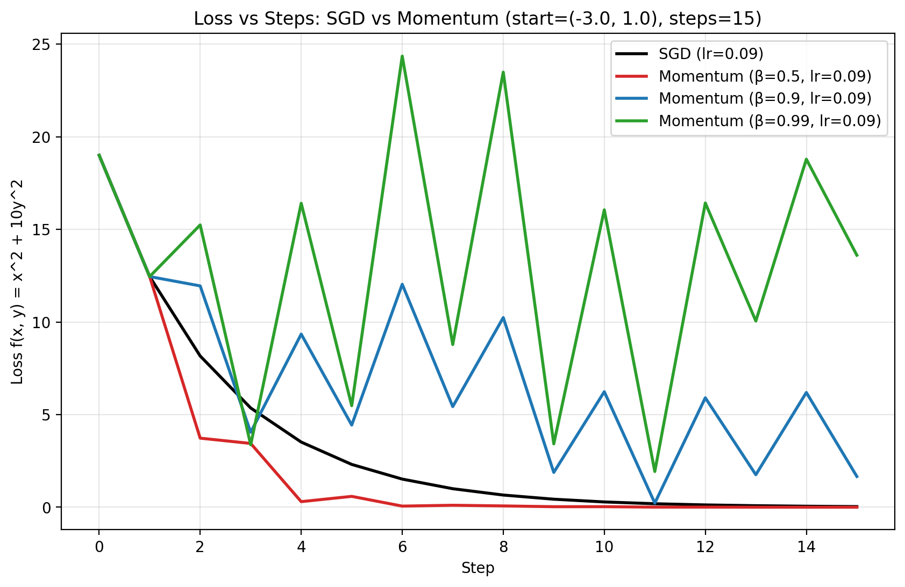

# Week 7 Session 2 - Optimizer code

Reference Marimo notebook: w7s2.py

## Code

```python
from abc import ABC, abstractmethod

class Optimizer(ABC):
    @abstractmethod
    def step(self, point, grad_f):
        pass
# Gradient function for z=x^2 + 10*y^2
def grad_f(x, y):
    return (2*x, 20*y)

class SGD(Optimizer):
    def __init__(self, learning_rate):
        self.learning_rate = learning_rate

    # Taking a step using GD for the function z=x^2 + 10*y^2
    def step(self, point, grad_f):
        (x,y)=point
        (dzdx,dzdy) = grad_f(x,y)
        new_x = x - self.learning_rate * dzdx
        new_y = y - self.learning_rate * dzdy
        return (new_x, new_y)

class MomentumSGD(Optimizer):
    def __init__(self, learning_rate, beta):
        self.learning_rate = learning_rate
        self.beta = beta
        self.vx_prev = 0
        self.vy_prev = 0


    # Taking a step using Momentum GD for the function z=x^2 + 10*y^2
    # Currently velocity state is hardcoded, I should generalize
    def step(self, point, grad_f):
        (x,y)=point
        (dzdx,dzdy) = grad_f(x,y)
        vx = self.beta * self.vx_prev + dzdx
        vy = self.beta * self.vy_prev + dzdy
        self.vx_prev = vx
        self.vy_prev = vy
        new_x = x - self.learning_rate * vx
        new_y = y - self.learning_rate * vy
        return (new_x, new_y)
```

## Loss vs Steps



## Observations

- Why $\beta=0.5$ helps but $\beta=0.9$ and $\beta=0.99$ oscillate (memory length + sign-flipping accumulation)
  - For this ravine the effective memory length can go from cancelling the sign flipping across the ravine to accumulating. When we cross that threshold, we get oscillations instead of convergence. The threshold is a joint condition on $\beta$ _and_ $\kappa$. Higher condition numbers require smaller $\beta$ to avoid sign-flip accumulation.

- The effective learning rate interaction: $\alpha/(1-\beta)$ and why it pushes past the stability threshold
  - When adding momentum, the effective learning rate changes, and in this case for .9 and .99 it exceeds the stability threshold. For vanilla GD the stability threshold would be $\frac{2}{\lambda_{max}}$, with momentum this changes but is still exceeded in the cases of 0.9)and 0.99.

- Why oscillation stays bounded: exponential decay caps velocity, $\beta=1$ would diverge
  - The values for $\beta$ are all <1, keeping velocity from become a pure integrator by ensuring there is decay. Even with the oscillations, rather than diverging. If $\beta = 1$ we would lose the decay and get divergence.
