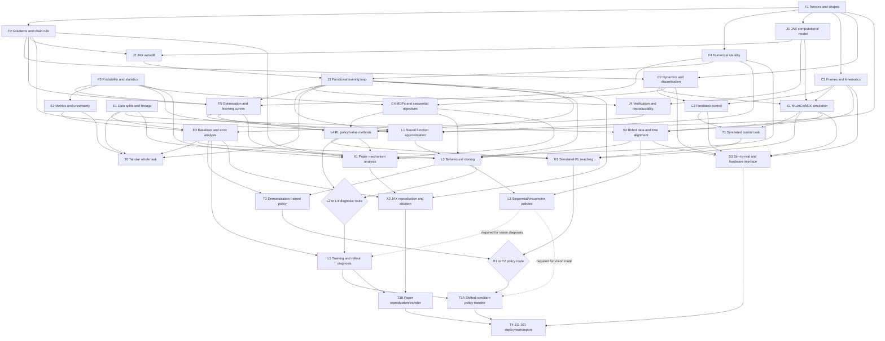

# Robot-Learning Dependency Graph

**Design stage:** confirmed working graph; evidence-gated and revisable  
**Learning phase:** Phase 0 — ML/JAX experimental foundations  
**Active frontier:** encode J1 `jit`/`vmap` constraints, then run an independence probe (protocol in [`AGENTS.md`](AGENTS.md)) to fade the scaffold on F1/F4/J2/J3 and E1–E3/T0.

The canonical vocabulary is defined in [`CONTEXT.md`](CONTEXT.md). This document records capability prerequisites separately from teaching-order preferences and milestone integration requirements.

## Design decisions

- North star: build, evaluate, and publicly document reproducible SO-101 robot-learning systems, with theory leading into bounded implementation.
- Physical deployment is desired evidence, not a hard completion gate.
- Simulation-first; initial task order is state-based simulated goal reaching → SO-101 tabletop reaching/grasping → vision only after the state pipeline works.
- RL is taught before behavioural cloning by learner preference. This is a **sequence constraint**, not a prerequisite edge.
- Phase 4 contains two evidence routes: shifted-condition policy transfer (T3A) and paper reproduction/ablation (T3B). They may be satisfied by one combined project, but both evidence sets are required.

## Evidence-state legend

Node state records the strongest current evidence for the bounded capability. It is not an attempt-error diagnosis.

| State | Meaning |
|---|---|
| `not-assessed` | No current performance evidence; make no competence claim. |
| `not-encoded` | A diagnostic established that the required knowledge or procedure is absent. |
| `encoded` | The mechanism has been accurately derived or explained, but executable performance is not yet shown. |
| `scaffolded` | Correct performance was produced with a traced reference, skeleton, hints, or equivalent guidance. |
| `independent` | Correct performance was produced closed-resource on a familiar task contract. |
| `transfer` | Independent performance survived a materially changed surface or constraint. |
| `delayed-secure` | Transfer-capable performance was reproduced after the node's declared delay. |

`K/R/M/D/P/F/T/C` remain **attempt errors**. A successful remedy may change node state, but the error code itself never becomes the node state.

## Edge semantics

| Edge | Meaning | Stored where |
|---|---|---|
| Prerequisite | Target capability depends on source capability. | Mermaid graph and node table |
| Sequence constraint | Deliberate teaching order without a capability dependency. | Sequence table |
| Integration requirement | Several capabilities must be combined to satisfy a milestone. | Whole-task nodes and phase exit gates |

## Canonical prerequisite DAG

The diagram and the node table encode the same prerequisite relationships. Alternative prerequisite sets are labelled explicitly.

## Sequence constraints

| Before | After | Rationale |
|---|---|---|
| R1 | L2 | Learner preference places RL before behavioural cloning after common JAX, MDP, simulation, and control prerequisites. This edge can be revised without changing what BC logically requires. |
| T0 | Phase 1 whole-task emphasis | Phase 0 supplies the experimental discipline reused in simulation and control. |

## Node specification

| ID | Node | Type | Prerequisites | Required level | Embedded retrieval / exercise | Current node state |
|---|---|---|---|---|---|---|
| F1 | Tensor algebra, shapes, broadcasting, matrix products | procedural | — | **Fluency** | Trace model/data shapes; write assertions | `scaffolded` |
| F2 | Multivariable calculus, chain rule, gradients | conceptual + procedural | F1 | Fluency for routine derivatives | Derive loss gradients; inspect gradient flow | `encoded` |
| F3 | Probability, estimation, distributions, sampling | conceptual + procedural | — | Familiarity → fluency for expectations/variance | Loss, uncertainty, metric interpretation | `not-assessed` |
| F4 | Log-sum-exp, precision, overflow, conditioning | conceptual + procedural | F1 | **Fluency** for common patterns | Stable losses; NaN/Inf tests | `scaffolded` |
| F5 | Optimisation: SGD/Adam behaviour, curvature, regularisation, learning curves | conceptual + procedural | F2, F3, F4, J3 | Familiarity initially | Controlled optimiser comparisons and curve diagnosis | `not-assessed` |
| J1 | Arrays, pytrees, PRNG keys, `jit`, `vmap` | procedural | F1 | **Fluency** for standard use | All later JAX implementations | `scaffolded` for arrays/pytrees/PRNG; `not-encoded` for `jit`/`vmap` |
| J2 | `grad`, `value_and_grad`, JVP/VJP, transform composition | conceptual + procedural | F2, J1 | Fluency for `value_and_grad`; familiarity for JVP/JVP composition | Gradient tests; loss/update implementation | `scaffolded` |
| J3 | Functional parameters, loss, gradients, update, batches | procedural | F4, J2 | **Fluency** | Every learned policy and reproduction | `scaffolded` |
| J4 | Unit/property tests, seeds, checkpoints, configs | procedural | J1, J3 | Familiarity → fluency | Reproduce experiment runs | `scaffolded` for tests/seeds; remaining surface `not-assessed` |
| E1 | Split unit, leakage, preprocessing, lineage | conceptual + procedural | — | **Fluency** for split-before-fit | Every dataset and policy-training run | `scaffolded` |
| E2 | Metrics, uncertainty, success and safety criteria | conceptual + discriminative | F3 *(uncertainty surface only; metric selection does not depend on it)* | Familiarity → fluency in selection | Metric defence; intervals; failure slices | `scaffolded` for metric selection under binary class imbalance; `not-assessed` for uncertainty — no interval has been computed |
| E3 | Baselines, ablations, error analysis, records | whole-task | E1, E2, J4 | Fluency for minimum experiment template | All whole-task reports | `scaffolded` |

| C1 | Frames, forward/differential kinematics, workspace, action conventions | conceptual + procedural | F1 | Familiarity → fluency for frame transforms | Calibration and simulator interface design | `not-encoded` |
| C2 | State, dynamics, discretisation, integration, actuator limits | conceptual + procedural | F1, F2 | Familiarity | Explain rollout divergence | `not-encoded` |
| C3 | Feedback error, stability intuition, trajectories, PID, saturation | conceptual + procedural | C1, C2 | Fluency for simple controller design | Scripted manipulation baseline | `not-encoded` |
| C4 | MDPs, returns, partial observability, sequential objectives | conceptual | F3, C2 | Familiarity → fluency for task formalisation | Specify reward/objective and rollout evaluation | `not-encoded` |
| S1 | MuJoCo/MJX state, reset/step, contacts, rendering | procedural + whole-task | C1, C2, J1 | Fluency for a standard environment | Simulated reaching/manipulation | `not-encoded` |
| S2 | Demonstrations, calibration, timestamps, observation-action alignment | procedural + discriminative | E1, C1, S1 | **Fluency** for integrity checks | Demonstration pipeline diagnosis | `not-encoded` |
| S3 | Identification, randomisation, latency, safety, calibration | conceptual + whole-task | C1, C2, C3, S1, S2 | Familiarity; fluency in preflight | Deployment discrepancy report | `not-encoded` |
| L1 | MLPs, representations, regularisation | conceptual + procedural | F1–F5, J3 | Familiarity → standard-MLP fluency | Tabular and state-policy baselines | `not-assessed` |
| L4 | Policy/value methods, exploration, credit assignment, off-policy issues | conceptual + procedural | C4, F5, J3 | Familiarity initially | Simulated RL reaching | `not-encoded` |
| R1 | Simulated state-based RL reaching | whole-task | T1, S1, L4, E3 | Independent with fading scaffold | Retrieves MDP, JAX, metrics, simulator | `not-assessed` |
| L2 | Supervised policy learning, covariate shift, rollout evaluation | conceptual + procedural | C4, E1, J3, L1, S2 | **Fluency** for standard implementation | Demonstration-trained policy | `not-encoded` |
| L3 | Image encoders, temporal context, action chunks | conceptual + procedural | L2, S2 | Familiarity initially | Vision-policy extension | `not-encoded` |
| L5 | Training and rollout diagnosis | perceptual-discriminative + whole-task | E3 and at least one of L2/L4; L3 for vision diagnosis | **Fluency** in failure classification | Curated failure log and ablations | `not-assessed` |
| X1 | Analyse mechanism, assumptions, load-bearing claims | conceptual + discriminative | F2–F5, C4, L4 | Familiarity → independent | Explain component before reproducing | `not-encoded` |
| X2 | Reimplement and ablate a paper mechanism in JAX | whole-task | X1, J3, E3 | Independent | Reproduction and benchmark comparison | `not-assessed` |
| T0 | Leakage-safe tabular baseline | whole-task | J3, E1–E3 (L1 is an integration requirement of the Phase 0 exit gate, not a prerequisite of every attempt) | Independent with checklist | Retrieves Phase 0 nodes | `scaffolded` narrow vertical slice; the slice was separable at a 1.0 ceiling, so it did not discriminate metric, slice, or leakage faults |
| T1 | State-based simulated control with scripted baseline | whole-task | C1–C3, S1 | Independent with scaffolded task definition | Retrieves control, simulation, metrics | `not-assessed` |
| T2 | Demonstration-trained policy | whole-task | L2, E3 | Independent with fading scaffold | Retrieves data, JAX, rollouts | `not-assessed` |
| T3A | Shifted-condition policy transfer | whole-task | L5 and at least one of R1/T2; L3 for vision route | Independent transfer | Changed environment, observations, or requirements | `not-assessed` |
| T3B | Paper reproduction and ablation under changed conditions | whole-task | X2, L5 | Independent transfer | Benchmark discrepancy and ablation | `not-assessed` |
| T4 | SO-101 deployment or evidenced blocker report | whole-task | T3A, T3B, S3 | Independent, safety-gated | Full-system retrieval under constraints | `not-assessed` |

## Integration requirements

Integration requirements are not prerequisite edges. They name capabilities that must be combined in a milestone, and they are checked at an exit gate rather than before every attempt on the node.

| Milestone | Integration requirement | Rationale |
|---|---|---|
| Phase 0 exit project | L1 — the exit project compares the linear baseline against a learned non-linear baseline under the same split, metric, and seed protocol | The narrow tabular slice used a linear model and never exercised L1. Holding L1 as a prerequisite of every T0 attempt produced a `scaffolded` node above a `not-assessed` prerequisite. |
| Phase 0 exit project | F3 — the primary metric is reported with an uncertainty interval | E2's uncertainty surface is the part that genuinely depends on F3, and it remains unevidenced. |

## Recognition-level leaves

| Leaf | Why recognition is sufficient |
|---|---|
| Optimiser and architecture taxonomy beyond the active system | Select and investigate only when a current experiment gives a reason. |
| JAX API details outside the active workflow | Knowing the computational model and how to verify behaviour is more valuable than exact API recall. |
| Robot-learning paper landscape beyond chosen mechanisms | Use paper triage; reserve deep study for components entering X2. |

## Learner-specific leverage and blind spots

| Area | Leverage | Blind spot to guard against |
|---|---|---|
| Functional programming → JAX | Pure functions, immutable transitions, composition, explicit effects | Affinity is not fluency with transforms, PRNG, shapes, device behaviour, or compilation. |
| Autodiff exposure | VJP purpose appears accessible. | VJP theory does not imply an independent training loop; J2 → J3 remains gated. |
| Experienced programming | Testing, tooling, instrumentation, reproducibility | Software intuition does not substitute for statistical validity, control stability, alignment, or safety. |
| Local compute | Repeatable local experiments and ablations | More runs do not repair a weak split, metric, baseline, or simulator model. |
